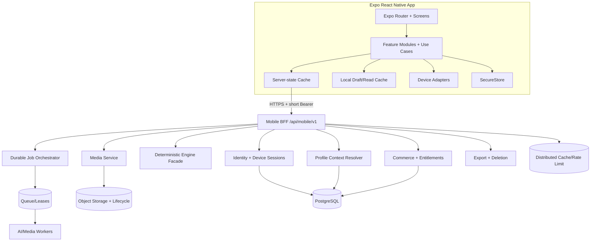

# Hourkey iOS + Android Architecture & Delivery Plan

> สถานะ: **TWO-TRACK (แก้ไขล่าสุด 13 ก.ค. 2026 · เจ้าของอนุมัติ Design A)**
> — **สายเร็ว (internal build): เดินต่อได้ทันที ไม่ต้องรอ G0** — เป้า: ล็อกอินจริง + หน้าหลักข้อมูลจริงจาก `/api/mobile/v1` + Account/Store แบบ fail-closed + APK/iOS ทดสอบภายใน · ทำใน worktree `/root/worktrees/hourkey-mobile-p0-network-sifu` · เขียนและทดสอบ wiring ซื้อ/restore/ลบบัญชีได้ แต่ห้ามทำธุรกรรมเงินจริงหรือทดลองลบบัญชีจริงอัตโนมัติ; ต้องใช้ sandbox/บัญชีทดสอบและ action ยืนยันเมื่อ infrastructure พร้อม
> — **สายสโตร์ (store release): ใช้เอกสารนี้เป็นด่าน** — ทุก gate G0–G6, ADR, TBD, checklist ในเอกสารนี้บังคับใช้ **ก่อนส่งขึ้น App Store/Play หรือเปิดขายจริง** เท่านั้น ไม่ใช่เงื่อนไขหยุดงาน internal build
> แผนสั่งงานละเอียด/ลำดับล่าสุดอยู่ที่ `/root/worktrees/hourkey-mobile-p0-network-sifu/docs/superpowers/plans/2026-07-13-hourkey-mobile-design-a-master-execution.md`; เอกสารนี้เป็น architecture/handoff ระดับผลิตภัณฑ์ ห้ามใช้แทน task-level TDD plan · checkpoint ที่ durable ของเอกสารนี้คือ commit ล่าสุดที่แตะ `pland.md` (`git log -1 --format=%H -- pland.md`)

## ⭐ เกณฑ์เหล็กข้อแรก (เจ้าของสั่ง 12 ก.ค. 2026): UI แอพต้องเหมือนหน้าเว็บมากที่สุด + ผ่านตา VLM ทุกหน้า

- **หน้าตา UI ของแอพต้องเหมือนหน้าเว็บ hourkey.io ให้มากที่สุด** — โทนสี/ลำดับข้อมูล/องค์ประกอบหลักต้องจำได้ทันทีว่าเป็น Hourkey เดียวกัน (ปรับ layout ให้เข้ากับจอมือถือได้ แต่ห้ามหลุดเอกลักษณ์)
- **ทุกหน้าต้องผ่านด่าน "เปิดตาดู" (VLM eye check) ก่อนถือว่าเสร็จ:** source-preview pipeline `implementer/eye/shoot.mjs` (Expo web + Chromium, ห้ามใช้ HTML mirror เขียนมือ) ใช้ตรวจระหว่างพัฒนาเท่านั้น; release gate ต้องถ่ายซ้ำจาก installed native APK ที่ผูก package/signature/APK SHA เดียวกัน เทียบกับหน้าเว็บจริงหน้าเดียวกัน (login บัญชีเดียวกัน) แล้วให้ VLM ตรวจทีละหน้า: หน้าตาเหมือน + ตัวเลข/ข้อมูลตรง — มีหลักฐานภาพคู่แนบทุกหน้า ห้ามติ๊กผ่านจากความจำ รูปเดิมใน `shots-live2`/`shots-w3` เป็น historical source preview 9 หน้า ไม่ใช่ final 12-route matrix
- **URL หน้าเว็บอ้างอิง (SoT ของหน้าตา) ต่อหน้าแอพทั้ง 12 หน้า:**

| # | หน้าแอพ | URL เว็บอ้างอิง |
| --- | --- | --- |
| 01 | วันนี้ | https://hourkey.io/today |
| 02 | ดวง | https://hourkey.io/chart |
| 03 | ปฏิทิน | https://hourkey.io/calendar |
| 04 | เครือข่าย | https://hourkey.io/yongsennetwork |
| 05 | ฉีเหมิน | https://hourkey.io/qimen ⭐⭐ **เกณฑ์พิเศษ (เจ้าของสั่ง 13 ก.ค.): STRICT PIXEL + ฟังก์ชันครบ 100%** — ข้อมูลฉีเหมินลงทุนซื้อมา 1 ล้านบาท · ผัง 9 วังต้องละเอียดเท่าเว็บทุกชั้น (八神/九星/八門/天干/地干/空亡/馬星/格局/值符值使) · ฟังก์ชันครบ: ตั้งคำถาม+จุดประสงค์ · ค้นเวลา-ทิศดี (/qimen/search) · ถามซินแสตีความ (/qimen/sifu) · น้ำหนัก用神ตามดวง · สำนัก 3 + ระดับเวลา 4 · ด่านตา VLM หน้านี้ตรวจแบบ strict ทีละวังทีละชั้น ห้ามหย่อน |
| 06 | พยากรณ์ | https://hourkey.io/forecast |
| 07 | วางฤกษ์ | https://hourkey.io/datepick |
| 08 | หล่อแก | https://hourkey.io/luopan |
| 09 | ซินแสแชต | https://hourkey.io/master |
| 10 | หลอมรวมศาสตร์ | https://hourkey.io/master-fusion — เป็นคนละ subsystem/route/state/API กับ `/master` ห้ามยุบเป็นหน้าเดียว |
| 11 | บัญชี | https://hourkey.io/account |
| 12 | ร้านค้า/แพ็กเกจ | https://hourkey.io/pricing |

## ⭐ Owner addendum — Generated artwork + web modal parity (13 ก.ค. 2026)

ข้อกำหนดชุดนี้เป็น **release gate ของ internal APK ที่เจ้าของเคาะ Design A แล้ว** ไม่ใช่งานตกแต่งภายหลัง และมีผลกับหน้าหลักทั้ง 12 หน้าในตารางด้านบน:

> ⚖️ **แก้สถานะโดยเจ้าของ 14 ก.ค. 2569 ("เอาสายกลาง"):** ข้อ 1–3 (ภาพเจนรายหน้า + provenance + ทิศทางศิลป์) **ถอดจากการเป็น release gate ของ internal APK** — ย้ายเป็น "เฟสอาร์ต" คู่ขนานไม่บล็อกการปล่อย: นำร่องเจน 3 หน้าฮีโร่ก่อน (วันนี้·ดวง·ฉีเหมิน) ให้เจ้าของเปิดดูจริงแล้วค่อยตัดสินขยายครบ 12 หรือตัดทิ้ง · มาตรฐาน manifest/SHA ตามข้อ 2 คงไว้ใช้เมื่อถึงเฟสอาร์ต · **ด่านปล่อย internal APK ที่แท้จริง = ฟังก์ชัน+โมดัลครบเหมือนเว็บ (ข้อ 4–7) + ตา VLM ผ่าน** · ข้อ 4–9 คงสถานะ gate ตามเดิม

1. **ทุกหน้าต้องมีภาพ bitmap ที่เจนใหม่เฉพาะหน้า** — ใช้ PNG/WebP/JPEG ที่สร้างด้วย image-generation workflow จริง ห้ามนับ SVG, gradient, icon, screenshot เว็บ, stock เดิม หรือภาพเดียวเปลี่ยนสีเป็นคนละหน้า ภาพต้องไม่มีตัวอักษร/ตัวเลข/อักขระจีนปลอมและต้องไม่ทำหน้าที่แทนผังหรือข้อมูลศาสตร์
2. **ภาพต้องมี provenance ตรวจย้อนกลับได้** — manifest ระบุ page ID, filename/version, prompt, generator/model, วันที่สร้าง, license/usage note, dimensions, byte size และ SHA-256; ไฟล์ที่แอปอ้างต้องตรงกับ manifest และแต่ละหน้าต้องมี SHA ไม่ซ้ำกัน
3. **ทิศทางศิลป์ Design A** — Hourkey แบบ museum/editorial: black lacquer, ivory paper, antique gold, mineral green และ cinnabar accent พร้อม texture/แสงจริง ภาพเป็น chapter masthead แบบกะทัดรัด ไม่แย่งพื้นที่ข้อมูลสำคัญใน first viewport และต้องรอดทั้ง dark/light theme
4. **modal / bottom sheet / dialog ที่จำเป็นต้องมีเหมือนเว็บทุก flow** — ทำ inventory จากหน้าเว็บจริงแล้วเทียบทีละ trigger, title, content, action และผลลัพธ์ ห้ามยุบข้อมูล modal ของเว็บเป็นข้อความสั้นบนหน้าหลักหรือทำปุ่มที่กดแล้วไม่เกิดอะไร
5. **ทุก modal ต้องมี state ครบ** — closed/open, loading, ready, empty, error, locked/entitlement, destructive confirmation และ success เมื่อ flow นั้นมีจริง; รองรับ close button, tap backdrop เมื่อปลอดภัย, Android back, iOS dismiss gesture, focus/keyboard, screen reader label และคืน focus ให้ trigger เดิม
6. **modal บังคับของสามหน้าวิชาหนัก**:
   - Qimen: แตะวังใดต้องเปิด palace-detail sheet เต็มข้อมูล Beginner/Professional ตามเว็บ โดยไม่แต่ง score/ranking/ความหมายเอง และ context ต้องผูกกับเวลาสำนักคำถามและ active profile ชุดเดียวกัน
   - Calendar: แตะวันต้องเปิด meaning sheet เกือบเต็มจอ มี sticky date header, คำแปลง่าย, คะแนน/กิจกรรม, 宜/忌, 12 ยาม, ดาว, ทิศ และ PDF/สิทธิ์ตามเว็บ
   - Luopan: แตะ/ซูมวงต้องเปิด ring inspector ที่บอกหมายเลขวง ชื่อ ชั้นข้อมูล องศา และคำอธิบายจาก canonical source; dial หลักยังต้องครบ 22 วงและหมุนสัมพันธ์กับ heading เดียวกัน
7. **modal สำคัญหน้าอื่นห้ามตก** — profile/date/person pickers, saved-date detail+delete confirm, Sifu context/history/attachment/error, Account avatar/password/device/export/support, Store product/purchase/restore/verification/entitlement และ system permission sheets ต้องเชื่อมของจริงหรือแสดง unavailable อย่างซื่อสัตย์
8. **Definition of “100%”** — ข้อมูลและฟังก์ชันเทียบเว็บครบทุกชั้น; layout ปรับเป็น native mobile pattern ได้ตาม Design A แต่ geometry สำคัญของ Qimen board และ Luopan 22 rings ต้องผ่าน strict golden/pixel gate ส่วนภาพประกอบและ modal ต้องผ่านการเปิดดูจริงโดย reviewer 5 agent ครบ TH/EN/ZH × dark/light. Android internal APK ผ่านได้ด้วย Android native + iOS Metro/source โดยต้องเขียน iOS native ว่า `OPEN/UNPROVEN`; cross-platform/store release ยัง `NO-GO` จน iOS native ผ่าน matrix เดียวกัน
9. **ห้ามยัดคลังศาสตร์ private ลง APK เพื่ออุด API** — ถ้า mobile contract ปัจจุบันไม่มีชั้นข้อมูลที่เว็บมี ให้เพิ่ม endpoint แบบ auth + ownership + entitlement-shaped ใน clean backend worktree, มี contract test/reviewer, commit ก่อน deploy และ cut release ใหม่ตามกฎ r514/r515; ห้ามแก้ `/root/releases/current` ตรงและห้ามให้ client เดาความหมาย/คะแนน

> Baseline audit: **12 กรกฎาคม 2026 · Asia/Bangkok**
> ตำแหน่งเอกสาร: `/root/decode-app/pland.md`
> ตำแหน่ง mobile client ที่มีอยู่: `/root/hourkey-mobile` (HEAD 4 มิ.ย.) · **งานล่าสุดจริงอยู่ที่ worktree `/root/worktrees/hourkey-mobile-p0-network-sifu`, branch `codex/mobile-p0-network-sifu`, baseline HEAD ก่อน plan bundle `e3a19084a7ab9df667cf76f191a8036d80d2aaca` เวลา `2026-07-13T13:40:17+07:00` — ดู §1.3b**
> ตำแหน่ง backend/BFF ที่มีอยู่: `/root/decode-app`

เอกสารนี้เป็น living plan, checklist และ handoff contract สำหรับสร้างแอป Hourkey บน iOS และ Android โดยอิงหน้าเว็บ live ที่เปิดดูจริง ไม่ใช่การคัดลอกแผน mobile เก่า และไม่ใช่คำสั่งให้เริ่มเขียนโค้ด

---

## 0. วิธีใช้เอกสารนี้

### 0.1 ป้ายกำกับ

| ป้าย | ความหมาย |
| --- | --- |
| `[OBS-LIVE]` | เห็นจริงจาก `hourkey.io` ณ วันที่ audit |
| `[OBS-REPO]` | เห็นจริงจาก source/config/commit ปัจจุบัน |
| `[INFERENCE]` | ข้อสรุปที่อนุมานจาก public copy, route/API และ repo; ยังไม่ใช่หลักฐานจาก protected UI |
| `[DECISION]` | สถาปัตยกรรมที่แนะนำให้ใช้เมื่อเริ่มงาน |
| `[PLAN]` | งานที่ต้องทำในอนาคต ยังไม่ได้ทำ |
| `[TBD]` | ต้องให้เจ้าของผลิตภัณฑ์หรือผู้รับผิดชอบตัดสินก่อน |
| `[BLOCKER]` | ห้ามผ่าน phase/release gate จนกว่าจะปิดประเด็น |
| `[NON-GOAL]` | สิ่งที่ตั้งใจไม่ทำในขอบเขตนั้น |

สถานะ checklist:

- `[ ]` ยังไม่เริ่ม
- `[~]` กำลังทำ ต้องมี owner/branch/handoff
- `[x]` เสร็จและมี evidence
- `[!]` blocked พร้อมเหตุผลและ next action

ห้ามติ๊ก `[x]` จากความจำหรือจากข้อความว่า “น่าจะผ่าน” ต้องใส่หลักฐานอย่างน้อย:

```md
Evidence: <test/report/link>
Repo/Commit: <repo>@<full SHA>
Build/API version: <identifier>
Device/OS or environment: <value>
Owner: <name>
Verified at: <ISO-8601 timestamp>
```

### 0.2 ทีม audit 5 สายงาน

แผนนี้สังเคราะห์จากการตรวจแยก 5 มุม:

1. Product และ live-site inventory
2. Visual/UX desktop + mobile
3. Mobile architecture และ brownfield migration
4. Backend, security, privacy และ commerce
5. QA, release, observability และ handoff

### 0.3 ลำดับ source of truth

เมื่อข้อมูลขัดกัน ให้หยุดและใช้ลำดับนี้:

1. Product/commerce/privacy decision ที่ owner อนุมัติและลง ADR แล้ว
2. Contract ที่ production ให้บริการจริงและมี contract test
3. Backend deterministic engine และฐานข้อมูล canonical
4. Mobile OpenAPI/schema ที่ generate client ได้
5. เอกสารนี้ใน revision ล่าสุด
6. เอกสารหรือ prototype เก่า

ห้ามใช้ copy บนหน้าจอ, hardcoded client constants หรือไฟล์เก่าเป็น entitlement/calculation source of truth

---

## 1. Audit snapshot และอายุของของเดิม

### 1.1 วันที่และ revision

| รายการ | หลักฐาน ณ 12 ก.ค. 2026 | ข้อสรุป |
| --- | --- | --- |
| แผนเดิม `docs/mobile-app-plan.md` | mtime 4 มิ.ย. 2026 06:06; commit `2b471e5` เวลา 06:08 | ใช้เป็น historical baseline เท่านั้น |
| Mobile repo HEAD | `e2ed09c3ed1f2e02944bed2a6812f559e219d04d`; 4 มิ.ย. 2026 10:16 | เก่ากว่า live/backend ปัจจุบัน |
| Mobile WIP ล่าสุดตาม mtime | `App.tsx` 4 มิ.ย. 2026 17:41 | มีงานไม่ commit; ห้ามถือ HEAD ว่าครบ |
| Decode repo HEAD ตอน audit | `dede5e9db394474850c0eea9d024d346e42c37c7`; 11 ก.ค. 2026 | ใหม่กว่า mobile ประมาณ 5 สัปดาห์ |
| Mobile session route mtime | 9 ก.ค. 2026 18:40 | backend mobile บางส่วนถูกเปลี่ยนหลัง prototype |
| Production working directory | `/root/releases/current` → `/root/releases/decode-app-r513-sifu-knowledge-tier` | ต้องบันทึก deployed SHA/manifest ก่อนเริ่มจริง |
| Live `/api/health` | HTTP 200 | backend หลักตอบ |
| Live `/mobile-preview/` | HTTP 502 | preview ไม่ใช่ release baseline |

`[BLOCKER-BASE-001]` ทั้ง `/root/decode-app` และ `/root/hourkey-mobile` มี dirty working tree และไฟล์ WIP จำนวนมาก ก่อน implement/release ต้อง snapshot และ reconcile WIP กับ owner, เลือก canonical starting SHA ที่อนุมัติ แล้วจึงสร้าง clean worktree จาก SHA นั้น ห้าม stash/pop/drop งานของผู้อื่นแบบสุ่ม

### 1.2 ข้อสรุป brownfield

`[DECISION-BASE-001]` งานนี้ไม่ใช่ greenfield และไม่ควรสร้าง repository/app ใหม่ทับของเดิม

- รักษา `/root/hourkey-mobile` เป็น mobile client
- รักษา `/root/decode-app` เป็น web + backend + mobile BFF
- audit ว่าอะไร retain/refactor/replace ก่อนเพิ่ม feature
- ไม่แก้สูตรดวงใน client
- ไม่เปลี่ยน contract เว็บเพียงเพื่อให้ mobile ใช้ง่าย

### 1.3 Baseline ของ mobile client ที่มีอยู่

`[OBS-REPO]`

- Expo SDK 56, React Native 0.85.3, React 19.2.3, TypeScript strict
- iOS bundle ID และ Android package: `io.hourkey.app`
- EAS profiles: development, preview, production
- `App.tsx` ประมาณ 1,224 บรรทัด ถือ auth, navigation, profile, orchestration และหลายหน้าจอรวมกัน
- `src/api/mobileClient.ts` ประมาณ 541 บรรทัดและ type contract เขียนด้วยมือ
- navigation ปัจจุบันเป็น `activeFlow` state switch ไม่ใช่ native route stack ที่รองรับ deep link/resume
- ไม่มี SecureStore dependency; token อยู่ memory บน native และ `localStorage` เมื่อรัน web
- ไม่มี server-state cache/query invalidation, offline policy, request cancellation หรือ race guard ที่เป็นระบบ
- design token มีมากกว่าหนึ่งชุดและค่าบางส่วนขัดกัน (`tokens.ts` กับ `styles.ts`)
- copy หลายส่วน hardcode ภาษาไทย
- attachment client/API มี แต่ UI หลักยังไม่ต่อครบ
- `/mobile-preview/` live ล้ม 502 ทำให้ smoke baseline ไม่ครบ
- signed-in shell ใช้ horizontal `webNav` ภายใน outer vertical `ScrollView` แทน native navigation
- ปุ่มหลายจุดสูงเพียง 34–38 และ icon button 36×36; แทบไม่มี `accessibilityRole`, `accessibilityLabel`, `accessibilityState`
- day/night theme ยังมี hardcoded dark colors หลายจุด
- มี mock/specialist components อีกชุดที่ยังไม่ต่อ route จึงยังไม่มี UI source of truth เดียว

### 1.3b ⚠️ แก้ baseline (อัปเดต 13 ก.ค. 2026) — ของจริงเดินไปไกลกว่าที่ audit เห็น

ข้อ 1.3 ด้านบน audit จาก `/root/hourkey-mobile` (HEAD 4 มิ.ย.) ซึ่ง**เก่ากว่างานจริง** — canonical coordination worktree ปัจจุบันคือ `/root/worktrees/hourkey-mobile-p0-network-sifu` บน `codex/mobile-p0-network-sifu`; baseline HEAD ก่อน Design A plan bundle คือ `e3a19084a7ab9df667cf76f191a8036d80d2aaca` สถานะด้านล่างเป็น historical baseline ของ 12 ก.ค. ไม่ใช่คำยืนยันว่า Design A implementation ผ่านแล้ว:

- **navigator เหลือชุดเดียวแล้ว** (design chrome rv3) — Codex chrome ที่ตายถูกผ่าออก (-504 บรรทัด) · `tsc --noEmit` 0 error · `expo export` ผ่าน · ทุกหน้าเข้าถึงได้จากหน้าแรก
- **SecureStore ใช้แล้ว** — `src/greenfield/token.ts` เก็บ token ใน `expo-secure-store` (native) — ข้อสังเกต "ไม่มี SecureStore" ใน §1.3 ใช้ได้กับ legacy `src/api/*` เก่าเท่านั้น
- **เส้นข้อมูล `/api/mobile/v1` พิสูจน์สดแล้ว 10/10** (session/signup/profiles/today/hours/chart/calendar/network/qimen/datepick/luopan×2/sifu-history) ด้วยบัญชีทดสอบสมัครจริงบน production
- **ระบบตาถ่าย source preview ใช้งานได้** — `implementer/eye/shoot.mjs` (Expo web + Playwright) ได้ภาพ historical preview 9/9 หน้า; ไม่ใช่ native APK evidence และไม่แทน final 12-route matrix
- นัยสำคัญ: MOB-P0-001/002/013 (snapshot/reconcile/เลือก canonical SHA) ต้องนับ worktree นี้เป็น**ผู้นำ** ไม่ใช่ HEAD 4 มิ.ย. · ห้ามอ้าง §1.3 เดิมเพื่อรื้องานที่เดินแล้ว

### 1.4 Baseline ของ mobile BFF ที่มีอยู่

`[OBS-REPO]` มี route ใต้ `/api/mobile/v1/*` แล้ว ครอบคลุมโดยรวม:

- session, signup, me
- profiles, related profiles, profile update
- chart
- today, today hours, today directions
- calendar
- date picking
- network และ network Sifu
- Sifu chat, group, history
- upload และ upload analyze

ข้อสังเกตสำคัญ:

- BFF บาง route query DB ตรง บาง routeเรียก handler เดิม และบาง route self-fetch ไป legacy API โดยแปลง Bearer เป็น cookie
- contract/error shape/version metadata ยังไม่เป็นมาตรฐานเดียว
- handwritten client types permissive และไม่มี drift gate
- rate limit และ AI semaphore หลายส่วนเป็น process-local
- upload ปัจจุบันใช้ local disk และ synchronous filesystem

---

## 2. วิธีสำรวจ live site

Firecrawl CLI ถูกเรียกตาม workflow แต่เครื่องยังไม่ authenticated จึงไม่สามารถดึงผลได้ การ audit จึง fallback เป็น Chromium/Playwright แบบ read-only และเปิดภาพ render จริง

สิ่งที่ตรวจ:

- desktop viewport `1440 × 1000`
- mobile viewport `390 × 844`
- เลื่อนหน้าเพื่อ trigger lazy/reveal content ก่อนถ่ายภาพแต่ละ section
- อ่าน title, heading, form fields, buttons, links, final URL และ auth redirect
- เปิด Home, Ask, Signup/Login, Pricing, Picker, Palmistry, Forecast, Feng Shui, Account, Accuracy และหน้าความรู้
- ทดสอบ guest behavior ของ protected routes

ข้อจำกัดของ audit:

- ไม่มีการใช้บัญชีจริงหรือข้อมูลส่วนตัวเพื่อเข้าหน้าหลัง login
- feature ภายใน protected screens จึงอ้างจาก public copy, route/API inventory และ repo เพิ่มเติม และติดป้าย `[OBS-REPO]` หรือ `[TBD]`
- ไม่ทำ payment, upload รูปจริง, ส่งคำถาม AI หรือ mutation ใด ๆ

---

## 3. Product truth จากหน้าเว็บ live

### 3.1 Core loop

หน้าเว็บไม่ได้ขาย “รายชื่อศาสตร์” อย่างเดียว แต่ขายวงจรการตัดสินใจเดียว:

```text
โปรไฟล์วัน/เวลา/สถานที่เกิด
        ↓
คำถาม + บริบทคน/เวลา/ทิศ/พื้นที่
        ↓
deterministic engines หลายศาสตร์
        ↓
คำตอบเดียว + เหตุผล + ข้อจำกัด/ความไม่แน่นอน
        ↓
ถามต่อ / บันทึก / เพิ่มปฏิทิน / แจ้งเตือน / ส่งออก
```

`[DECISION-PROD-001]` Active profile และ context version ต้องเป็นแกนกลางของทุก feature ไม่ใช่ให้แต่ละหน้าเดา profile เอง

### 3.2 Public และ protected route inventory

| Web route | สิ่งที่เห็นจริงแบบ guest | Native placement ที่แนะนำ | Phase |
| --- | --- | --- | --- |
| `/` | Marketing, sample answer, product catalog, FAQ | ไม่ต้อง clone; onboarding/help บางส่วนใช้ copy ร่วม | P0 content contract |
| `/ask` | Public question-first funnel + preview/paywall | Public Ask onboarding | MVP |
| `/signup?tab=login` | Login/Signup, LINE, Google, email/phone, reset/OTP; Apple buttonมีใน DOM แต่ซ่อน | Auth stack | MVP |
| `/pricing` | Free/Premium/Master + top-up | Me → Plan & Credits | MVP หากเปิด commerce |
| `/today` | Redirect login | Today tab | MVP |
| `/calendar` | Redirect login | Calendar tab | MVP |
| `/master` | Redirect login | Sifu tab | MVP |
| `/chart` | Redirect login | Me → Charts | MVP |
| `/datepick` | Redirect login; feature จริง | Tools → Date Picking; link จาก Calendar | P1 |
| `/picker` | Public showcase/demo UI | ไม่สร้างเป็น feature แยก | No native parity |
| `/network`, `/yongsennetwork` | Redirect login; route ซ้ำ | Tools → People/Network | P1 |
| `/qimen` | Redirect login | Tools → Qi Men | P1/P2 |
| `/master-fusion` | Redirect login | Tools → Fusion | P1 |
| `/book` | Auth gate | Tools → Natal Book / reports | P1 |
| `/forecast` | Public shell; I-Ching/Meihua/QMDJ | Tools → Forecast | P1 |
| `/fengshui`, `/compass-studio` | Public shell; map, compass, facing, 9-palace preview | Tools → Feng Shui Lite | P2 |
| `/luopan` | Public HTML แล้ว client gate; workbench ลึก | Tools → Luopan Pro | P2/P3 |
| `/palmistry` | Public upload shell; analysisต้อง auth/credits | Tools → Palmistry | P2 |
| `/uranian`, `/tianxing` | Specialist shells | Tools → Advanced Astrology | P3 |
| `/account` | Guest shell; profile/security/devices/notification/export/delete | Me → Settings & Privacy | MVP |
| `/methodology`, `/accuracy`, science articles | Trust/education | Help/Trust; system browser or reader | P1 |
| `/terms.html`, `/privacy.html` | Legal | Settings + pre-auth links | MVP |

`[BLOCKER-PROD-001]` ต้องทำ canonical feature map ก่อน coding เพราะมีชื่อ/route ซ้ำ:

- `picker` vs `datepick`
- `network` vs `yongsennetwork`
- `fengshui` vs `compass-studio` vs `luopan`
- public `ask` vs authenticated `master`

### 3.3 Product capability inventory จาก live + repo

รายการนี้แยกระดับหลักฐานออกจากกัน เพราะการ audit รอบนี้ไม่ได้ login เข้า protected UI รายละเอียดที่มาจาก repo/public marketing copy จึงไม่ใช่หลักฐานว่าหน้าจริงหลัง login มี UX ตามนั้นครบแล้ว

#### Public Ask `[OBS-LIVE]`

- วันเกิดทั้งสุริยคติ/จันทรคติ, พ.ศ./ค.ศ., เดือนปกติ/อธิกมาส
- เวลาเกิด, ไม่ทราบเวลา, 夜子時/day-boundary, เมือง/timezone
- เพศ, ชื่อ/ชื่อเล่น, คำถามและ quick prompts
- preview ก่อน unlock

#### Authenticated AI Sifu `[OBS-REPO]` `[INFERENCE]`

- AI Sifu แบบต่อเนื่อง, history และ Fusion
- คำตอบแสดง summary, supporting/risk factors, conditions และ next action

#### Today / Calendar / Date Picking `[OBS-REPO]` `[INFERENCE]`

- daily score, good/avoid actions, 12 ชั่วยาม, directions
- monthly calendar
- mission/activity picker, date range, result ranking
- score layers Tongshu + Yongshen + Qi Men
- related people/opponent context
- save date, add to calendar, continue to Sifu

#### Chart / People / Fusion / Book `[OBS-REPO]` `[INFERENCE]`

- BaZi chart/profile context
- multi-profile, relationship/network, pair/team
- 6ศาสตร์ Fusion
- long-form report/PDF

#### Forecast / Spatial / Palm `[OBS-LIVE]` `[OBS-REPO]`

- I-Ching/Meihua/QMDJ/coin-toss forecast
- Compass/GPS/map/manual heading, facing/sitting, 9-palace and floor plan
- Luopan rings/pins/AI/PDF
- left/right palm images, dominant hand, approximate age, question, save/PDF

#### Account / Commerce / Trust `[OBS-LIVE]` `[OBS-REPO]`

- profile/avatar, password, devices, notification preferences
- account data export/delete
- Free/Premium/Master, credits “ยาม”, top-up
- methodology, accuracy, sources, limitations
- disclaimer: ไม่ใช่คำแนะนำทางแพทย์ กฎหมาย หรือการเงิน

### 3.4 Pricing snapshot และ contract drift

`[OBS-LIVE]` หน้า Pricing ณ วันที่ audit แสดง:

| Product | ราคา/copy ที่เห็น | ยาม | ลักษณะ |
| --- | --- | --- | --- |
| Free | ฿0 + trial 14 วัน | 1,000 แรกเข้า | หลัง trial ใช้โหมดฟรี |
| Premium | ฿399 / 30 วัน | +500 | copy ระบุไม่ต่ออายุเอง |
| Master | ฿990 / 30 วัน | +2,000 | copy ระบุไม่ต่ออายุเอง |
| Top-up | 100/550/1,700 ยาม | ไม่หมดอายุตาม copy | digital credits |

`[BLOCKER-COM-001]` แหล่งข้อมูลขัดกัน:

- mobile signup code คืน 500 ยาม แต่ Pricing live บอก 1,000
- working tree มี yearly packages แต่ live package API ยังเป็น 30-day/top-up
- Account/Ask/legacy copy บางแห่งใช้จำนวน/อายุ package ต่างกัน

ก่อนสร้าง paywall ต้องมี server-authoritative catalog และ capability matrix เดียว

---

## 4. Visual audit และ design direction

### 4.1 สิ่งที่ควรเก็บจากเว็บ

`[OBS-LIVE]`

- cinematic dark observatory mood
- พื้นหลังหลักประมาณ `#090706`
- ข้อความหลักโทนอุ่นประมาณ `#F7EFE3`
- ทอง, แดงและน้ำตาลเป็น accent/action colors ที่พบซ้ำ แต่ยังไม่ใช่ semantic system เดียวกันทุก route
- พบทั้ง Noto Sans Thai, serif Thai/Chinese และ font stacks อื่น; typography บน live routes ยังไม่สม่ำเสมอ
- อักษรจีนใช้เป็น visual anchor ไม่ใช่ label เดียว
- card แยก summary, evidence, risk และ action
- ภาพ Luopan, ท้องฟ้า, แปลนและเครือข่ายเป็น product identity
- traceability และ “ข้อมูลไม่ครบ/ข้อจำกัด” เป็นส่วนหนึ่งของความน่าเชื่อถือ

`[DECISION-UX-001]` Native app รักษา identity แต่ต้องสร้าง design system ใหม่ที่เหมาะกับมือถือ ไม่ใช้ CSS/web layout ตรง ๆ

### 4.2 ปัญหาที่เห็นบน mobile web และห้ามลอก

- Home top bar ยังอยู่ใน viewport 390px แต่ brand + language + CTA + hamburger แน่นและมีพื้นที่สัมผัสน้อย
- Ask CTA ยังเห็นใน first viewport แต่ภาพนำใช้พื้นที่มากและแย่งลำดับสายตา
- Signup มี whitespace ก่อน form มาก; theme control ประมาณ 27×30 เล็กเกิน native target
- Pricing comparison table กว้างราว 620px บน viewport 390px และ language control ราว 29×24
- specialist navbar ของ Picker, Palmistry และ Feng Shui หลุดออกจาก viewport; Picker ยังมี desktop data density สูง
- Palmistry two-column upload cards ไม่ทำให้ทั้ง page overflow แต่คับแคบและทำให้ปุ่ม/คำแนะนำอ่านยาก
- sticky navigation กินพื้นที่มากเมื่อ font scale สูง
- Signup inputs และ Picker form controls บางจุดขาด programmatic label/accessible name
- glyph จีนและรูปบางจุดยังไม่ชัดว่า decorative หรือ informative สำหรับ assistive technology

### 4.3 Design-system rules

- ใช้ semantic tokens: `surface`, `surfaceRaised`, `textPrimary`, `textMuted`, `accent`, `actionPrimary`, `actionSecondary`, `actionDestructive`, `success`, `warning`, `danger`
- token source เดียว; ห้ามมีสี/spacing/typography หลาย registry
- รองรับ dark เป็น launch theme; light themeเป็น ADR ไม่ใช่ hardcodeครึ่งหนึ่ง
- typography ต้องผ่าน Dynamic Type/font scale 200%
- content density ใช้ progressive disclosure: summary → reasons → technical detail
- ทุกจีน glyph มี localized accessible label
- state ห้ามใช้สีอย่างเดียว: ต้องมี icon + label + description
- primary action เห็นใน first viewport หรือ sticky bottom action ที่ไม่บัง keyboard/safe area
- loading ใช้ skeleton/step progress ตามประเภทงาน ไม่ใช้ spinner ค้างแบบไม่บอกสถานะ
- error ต้องบอกสิ่งที่เกิด, สิ่งที่ผู้ใช้ทำได้ และ request ID เมื่อเหมาะสม
- destructive actions ใช้ confirmation + recent auth ตามระดับความเสี่ยง

---

## 5. Information architecture ที่แนะนำ

### 5.1 Navigation shell

เว็บมีมากกว่า 10 destinations จึงไม่ควรยก navbar ลง bottom bar

`[DECISION-IA-001 · APPROVED by owner 12 ก.ค. 2026 — ยึดดีไซน์ rv3 ที่เจ้าของเคาะแล้ว]`

```text
Root Stack
├─ Auth / Signup / Reset
├─ Birth-profile onboarding
└─ Main Tabs (rv3 — ตามแอพจริงที่เดินอยู่)
   ├─ ดวง (命)
   ├─ วันนี้ (日)      ← หน้าแรกหลังเข้า
   ├─ ซินแส (師)
   ├─ วางฤกษ์ (擇)
   └─ เครือข่าย (人)
   + ปุ่ม "ศาสตร์" บน header → sheet: ปฏิทิน · ฉีเหมิน · พยากรณ์ · หล่อแก · ลายมือ · ร้านค้า
   + avatar → บัญชี
```

(ข้อเสนอเดิม วันนี้/ปฏิทิน/ซินแส/เครื่องมือ/ฉัน ถูกแทนที่โดยการตัดสินใจเจ้าของ — เก็บไว้เป็นตัวเลือกถ้าจะทำ usability test ในสายสโตร์ภายหลัง ไม่ใช่ blocker):

```text
(superseded) Main Tabs: วันนี้ · ปฏิทิน · ซินแส · เครื่องมือ · ฉัน
```

รายละเอียด:

- **วันนี้**: daily verdict, actions, hours, directions, recent saved event
- **ปฏิทิน**: month/day detail, saved dates, CTA ไป Date Picking
- **ซินแส**: new question, active profile, attachments, thread/history, jobs
- **เครื่องมือ**: Date Picking, People, Qi Men, Forecast, Fusion, Book, Palmistry, Feng Shui/Luopan, advanced tools
- **ฉัน**: profiles และ Chart, plan/credits, purchases, language/theme, devices, notification, privacy/export/delete

เหตุผลที่ไม่ใช้ current 5 flows เป็น tabs ทั้งหมด:

- `Datepick`, `People`, `Chart` เป็น features ที่สำคัญแต่ไม่ควรบล็อกพื้นที่ของ Tools/Account เมื่อ product ขยาย
- Calendar เป็นพฤติกรรมความถี่สูงและเป็น destination ที่ผู้ใช้เข้าใจง่าย
- Sifu ต้องตรงกับ question-first promise และเป็น action กลาง

`[TBD-IA-001]` ให้ usability test เปรียบเทียบ shell นี้กับ shell เดิม `Sifu / Today / Datepick / People / Chart` ก่อนปิด ADR โดยใช้ผู้ใช้ใหม่และผู้ใช้เดิมอย่างน้อยกลุ่มละ 5 คน

`[TBD-IA-002]` เลือก first destination หลัง onboarding ว่าเข้า Today เพื่อ daily retention หรือ Sifu เพื่อ question-first promise; ต้องปิดพร้อม Section 24 ข้อ 1

### 5.2 Active profile rules

- ทุกหน้าที่ผลลัพธ์ขึ้นกับดวง/บุคคลต้องแสดง subject และ active profile/context อย่างชัดเจน; Me/Settings, commerce, privacy, support และ Tool Hub ที่ยังไม่เลือกงานไม่ต้องแสดง selector
- active profile เปลี่ยนได้จาก shared selector
- URL/deep link และ job context ต้องระบุ profile ID/version ที่ใช้
- request เก่าต้อง cancel หรือ ignore หาก profile ถูกสลับ
- ห้าม fallback ไป “รายการแรก” เมื่อไม่รู้ว่าเป็นใคร
- no-profile ต้องไป onboarding; missing/archived profile ต้องเป็น recoverable state

### 5.3 Route state machine

```text
boot
 ├─ configuration_error
 ├─ offline_unknown_session
 ├─ signed_out
 ├─ authenticated_no_profile
 ├─ authenticated_profile_stale
 └─ ready
```

ห้ามรวม offline/timeout กับ signed-out เพราะจะทำให้ผู้ใช้ถูกเตะออกหรือเห็น profile ผิด

### 5.4 Screen inventory สำหรับ design/engineering handoff

| Area | Screens/flows ที่ต้องมีในแบบ |
| --- | --- |
| Public/Auth | Splash/config error, value intro, Public Ask, preview, sign in/up, OTP/reset, OAuth return, Terms/Privacy |
| Onboarding | language/timezone, birth date/time/unknown time, birthplace, True Solar Time disclosure, chart confirmation, notification education |
| Today | summary, hours, directions, day detail, stale/offline state |
| Calendar | month, day detail, saved dates, reminder/calendar handoff |
| Sifu | thread list, new question, chat/detail, profile/context picker, attachment tray, queued/running/result/retry/cancel |
| Me/Chart | profiles, profile editor, Chart summary, full Chart shared route, plan/credits, purchases, settings/devices/privacy/support |
| Tools | Tool Hub, Date Picking search/results/detail, People/person/pair/team, Forecast, Fusion, Book/report, Qi Men |
| Palmistry | consent, permission education, left/right capture, quality check, upload/process, result, retry/delete |
| Feng Shui/Luopan | project/address/map, permission education, calibration, heading/manual fallback, facing confirmation, floor plan, result |
| Commerce | value preview, paywall, purchase pending/success/fail, restore, manage subscription/entitlement state |

ทุก data screen ต้องออกแบบ `loading/skeleton`, `empty`, `offline`, `partial`, `error/retry`, `locked/paywall`, `ready`, `refreshing`, `stale` และ `permission denied` เมื่อเกี่ยวข้อง

### 5.5 Native component inventory

- shell: native stack, bottom tab, safe-area screen header, modal/sheet, error boundary
- context: `ProfileContextChip/Sheet`, locale/timezone indicator, capability/entitlement guard
- content: `SectionCard`, `MetricCard`, `StatusChip`, `ThaiChineseLabel`, `ScoreGauge`, `HourTimeline`, `DirectionCompass`, `ResultCard`, `LockedCard`
- input/action: primary/secondary/destructive/icon button, segmented control, native date/time picker, searchable place picker, persistent form label/error
- AI: `ChatBubble`, composer, thread row, attachment tray, stream/job progress, retry/cancel
- media/device: `PhotoCaptureCard`, quality checklist, upload progress, permission rationale, calibration/accuracy panel
- system states: `OfflineBanner`, stale marker, skeleton, empty/error panel, toast, paywall sheet
- accessibility contract: minimum touch target, name/role/state/hint, focus order/restore, Dynamic Type, reduced motion และ haptics ที่ไม่เป็นช่องทางเดียว

---

## 6. User journeys ที่ต้องออกแบบครบก่อน coding

### J01 — Public Ask → Account → Full answer

1. เริ่มถามโดยไม่ต้อง login
2. กรอกวัน/เวลา/สถานที่เกิด พร้อม unknown-time rules
3. กรอกชื่อ/เพศ/คำถาม
4. บันทึก draft แบบ local, มี expiry และไม่มีข้อมูลเกินจำเป็น
5. ขอ preview ด้วย idempotency key
6. แสดงสิ่งที่คำนวณได้/ไม่ได้และ paywall
7. สมัคร/เข้าสู่ระบบผ่าน system browser/native auth
8. callback กลับ draft เดิม
9. ซื้อ/restore entitlement หากจำเป็น
10. เริ่ม durable report job
11. background/relaunch แล้ว resume job เดิม
12. เปิด full answer, ถามต่อ, save/share

### J02 — Signup → Birth Profile → Today

- email/password หรือ provider ที่ผ่าน ADR
- accept Terms/Privacy version
- create canonical self profile
- timezone/location resolution และ True Solar Time disclosure
- unknown time modeต้องใช้ได้
- success เข้า Today หรือ Sifu ตาม `[TBD-IA-002]`

### J03 — Sifu conversation

- เลือก profile/thread/topic
- แนบไฟล์แบบมี purpose/retention disclosure
- submit once, show queued/running/partial/completed
- stream เมื่อ foreground; poll/push fallback
- แสดง source layers, caveat และ credit settlement
- resume/history ไม่ปน profile

### J04 — Date Picking → Save → Reminder

- เลือก mission/date range/weights/people
- server คำนวณและ rank
- ดู summary แล้ว drill-downแต่ละศาสตร์
- save candidate แบบ idempotent
- add to device calendar เมื่อผู้ใช้กดและยอม permission
- schedule notification ที่ timezone ถูกต้อง

### J05 — People / Pair / Team

- เพิ่ม related profile พร้อม relationship/consent notice
- เลือก center/peer/team
- score และ Sifu contextผูก snapshot
- edit/archive/delete แล้ว invalidate cache/historyอย่างถูกต้อง

### J06 — Palmistry

- ขอ camera/photo permissionเมื่อกดใช้
- guide pose/light/focus; ซ้าย/ขวา/มือถนัด
- quality check/reshoot
- strip EXIF → upload → job → delete rawตาม policy
- save resultหรือ PDF เฉพาะเมื่อเลือก

### J07 — Feng Shui / Luopan Lite

- pre-permission explanation
- sensor availability/calibration/accuracy
- manual heading fallback
- lock heading/facing/sitting โดยผู้ใช้ยืนยัน
- location optional; ไม่มี background tracking
- save house/floor plan ตาม consent
- แสดง boundary warning ใกล้รอยต่อ 24 ภูเขา

### J08 — Purchase / Restore / Refund

- load product/priceจาก Store
- purchase → server verify → ledger grant → entitlement refresh
- pending/cancel/error ไม่ grant
- restore/reconcile ข้ามเครื่อง
- refund/revocation/clawback ตาม policy
- ห้าม double-grant/double-debit

### J09 — Export / Delete account

- recent authentication
- export status/job/download
- deletion explains store subscription/retained legal records
- revoke sessions/providers/push
- purge profiles, history, jobs, media, derivatives, caches
- confirmation เมื่อเสร็จ

---

## 7. Scope และ release slices

### 7.1 MVP ที่แนะนำ

`[PLAN-MVP]`

- App foundation, auth/session, deep link
- Create/edit/select birth profile
- Today
- Calendar
- Chart summary ภายใต้ Me
- Public Ask → preview → full report job
- Sifu follow-up/history
- credits/entitlement read model
- Account, language, privacy export/delete
- background/relaunch resume สำหรับ draft/job
- notification “report ready” หาก push ผ่าน gate

### 7.2 P1 — Decision and retention

- Date Picking + saved date + device calendar
- Forecast
- People/Pair/Team
- Fusion
- Book/PDF/share
- daily/saved-date notifications

### 7.3 P2 — Native-heavy

- Luopan Lite: measure → confirm → save → preview
- Feng Shui map/floor-plan basic
- Palmistry camera/photo flow
- Qi Men visualization

### 7.4 P3 — Specialist

- Luopan 22+ ring workbench
- floor-plan pins/advanced overlay
- Uranian/Tianxing/advanced visualizations
- professional/team workflows

### 7.5 Non-goals ของ MVP

- ไม่ clone ทุก HTML page
- ไม่ย้าย BaZi/Qi Men/Luopan formulas ลง client
- ไม่ทำ offline calculation
- ไม่เปิด WebView checkout สำหรับ digital goods
- ไม่เปิด background location
- ไม่รองรับ tablet เพียงเพราะ `supportsTablet:true` หากยังไม่ออกแบบ/test
- ไม่สร้าง microservices ทั้งระบบก่อนพิสูจน์ modular-monolith boundary

---

## 8. Architecture decisions (ADR index)

| ADR | สถานะเริ่มต้น | Recommendation |
| --- | --- | --- |
| ADR-001 Platform | Proposed | คง Expo 56 + React Native + TypeScript; ไม่ rewrite native/Flutter |
| ADR-002 Navigation | Proposed | Expo Router, root stack + auth/onboarding + 5 tabs + detail/modal stacks |
| ADR-003 IA | Pending usability | Today/Calendar/Sifu/Tools/Me |
| ADR-004 State | Proposed | Server state ด้วย query cache; local state/store เล็กและมี owner |
| ADR-005 API | Proposed | Mobile เรียก versioned BFF เท่านั้น |
| ADR-006 Contracts | Proposed | OpenAPI/schema เป็น source; generated client + CI drift gate |
| ADR-007 Auth | Blocked current | short access + rotating refresh + SecureStore + device revoke |
| ADR-008 Offline | Proposed | read-only stale-safe; no client engines |
| ADR-009 AI jobs | Proposed | durable jobs เป็นแกน; stream enhancement; poll/push fallback |
| ADR-010 Device adapters | Proposed | camera/location/compass/push/IAP/share หลัง interfaces |
| ADR-011 Commerce | Pending owner/policy | StoreKit/Play Billing + server entitlement/ledger |
| ADR-012 Media | Proposed | object storage, scan, lifecycle, delete derivatives |
| ADR-013 Observability | Pending vendor | PII-scrubbed crash/perf/trace/product events |
| ADR-014 OTA | Pending | runtime compatibility, signed update, staged rollout, rollback |
| ADR-015 Tablet/theme/rotation | Pending | รองรับเมื่อมี design/test; otherwise disable claim |

### 8.1 Platform tradeoff

`[DECISION-ADR-001]` ใช้ Expo/React Native ต่อ เพราะ:

- codebase มีอยู่และผูก API แล้ว
- รองรับ iOS/Android จาก source เดียว
- Expo SDK 56 มี SecureStore, camera, notifications, location และ sensors
- ใช้ custom dev client/prebuild เมื่อ native capability ต้องการ

เหตุผลไม่เลือก:

- Pure Swift/Kotlin: duplicate product logic/UI และทีมต้องดูแลสอง clientเต็ม
- Flutter: rewrite prototypeและไม่ได้ลด backend complexity
- PWA-only: canary ปัจจุบันยังไม่ใช่ native store/product baseline และ device/store lifecycle ต่างกัน

### 8.2 Architecture overview



เริ่มเป็น modular monolith ได้ ไม่จำเป็นต้องแตกทุกกล่องเป็น service แยก แต่ AI/media worker ต้องไม่ผูกกับอายุของ HTTP process

### 8.3 Target mobile folder structure

```text
hourkey-mobile/
├─ app/
│  ├─ _layout.tsx
│  ├─ (public)/
│  │  ├─ ask/
│  │  ├─ sign-in.tsx
│  │  └─ sign-up.tsx
│  ├─ onboarding/
│  │  └─ birth.tsx
│  ├─ (tabs)/
│  │  ├─ _layout.tsx
│  │  ├─ today/
│  │  ├─ calendar/
│  │  ├─ sifu/
│  │  ├─ tools/
│  │  └─ me/
│  ├─ tools/
│  │  ├─ datepick/
│  │  ├─ people/
│  │  ├─ qimen/
│  │  ├─ forecast/
│  │  ├─ fusion/
│  │  ├─ book/
│  │  ├─ palmistry/
│  │  └─ luopan/
│  ├─ chart/
│  └─ settings/
├─ src/
│  ├─ core/
│  │  ├─ api/
│  │  ├─ auth/
│  │  ├─ config/
│  │  ├─ observability/
│  │  └─ storage/
│  ├─ design-system/
│  │  ├─ tokens/
│  │  ├─ components/
│  │  └─ patterns/
│  ├─ features/
│  │  ├─ auth/
│  │  ├─ onboarding/
│  │  ├─ profiles/
│  │  ├─ today/
│  │  ├─ calendar/
│  │  ├─ chart/
│  │  ├─ sifu/
│  │  ├─ datepick/
│  │  ├─ network/
│  │  ├─ forecast/
│  │  ├─ fusion/
│  │  ├─ palmistry/
│  │  ├─ fengshui/
│  │  ├─ commerce/
│  │  └─ privacy/
│  ├─ device/
│  │  ├─ secure-storage/
│  │  ├─ media-picker/
│  │  ├─ connectivity/
│  │  ├─ notifications/
│  │  ├─ location/
│  │  ├─ compass/
│  │  ├─ purchases/
│  │  └─ share/
│  └─ shared/
│     ├─ errors/
│     ├─ i18n/
│     ├─ types/
│     └─ utils/
└─ tests/
   ├─ unit/
   ├─ component/
   ├─ contract/
   └─ e2e/
```

โครงสร้างนี้เป็น target inventory ตาม scope ที่เสนอ ไม่ใช่คำสั่งให้สร้างทุก directory ล่วงหน้า; feature จะเกิดเมื่อ release scope ของมันผ่าน gate แล้วเท่านั้น

Boundary rules:

- `app/` ประกอบ route; ไม่เขียน business/calculation logic
- `features/*` export ผ่าน public API ของ feature
- DTO, domain model, view model และ component props แยกกัน
- API payload ไม่เก็บใน global client store
- token ห้ามเข้า query cache, AsyncStorage, analytics หรือ log
- platform-specific code อยู่ `device/` หรือ `.native/.web`
- formulas/engine/calculation version อยู่ server เท่านั้น

---

## 9. Mobile application architecture

### 9.1 State ownership

`[DECISION-APP-001]` แยก state เป็น 4 ประเภท:

| State | Owner | ตัวอย่าง | Storage rule |
| --- | --- | --- | --- |
| Secret session | Auth module | access/refresh token | SecureStore เท่านั้น |
| Server state | Query/cache layer | profile, Today, calendar, entitlement | cache ตาม user/profile/version |
| Durable local draft | Feature repository | Ask draft, unsent form | local encrypted/minimized + expiry |
| Ephemeral UI | Screen/component | open sheet, selected segment | memory; ไม่ต้อง persist |

กฎ:

- ห้าม copy server payload ทั้งก้อนไป global store
- ห้าม cache token หรือ payment credentialกับ query library
- query key ต้องรวม `userId/orgId/profileId/date/timezone/engineVersion` ตามบริบท
- sign-out, account switch และ revoke ต้อง clear cacheที่เกี่ยวข้องแบบ deterministic
- mutation success ต้อง invalidate เฉพาะ dependency ที่ถูกต้อง
- request ต้องมี AbortSignal หรือ response-version guard เพื่อกัน race

Pre-auth Ask draft มีวันเกิด/คำถามซึ่งเป็นข้อมูลอ่อนไหว จึงต้องมี storage contract แยก:

- เก็บเท่าที่จำเป็น, encrypt at rest ด้วย key ที่ผูกกับ platform secure storage และ exclude จาก cloud/device backup ตาม capability
- มี TTL/purge เมื่อ abandon, app reset หรือหมดอายุ
- หลัง login/account linking ย้ายเข้า server เมื่อผู้ใช้ยืนยัน context; ห้ามผูกกับบัญชีผิด
- sign-out/account switch ต้อง purge หรือแยก namespace แบบ deterministic ตาม product decision
- ห้ามใช้ AsyncStorage/plaintext หรือส่ง draft เข้า analytics/crash report

### 9.2 Offline policy

`[DECISION-APP-002]` MVP เป็น read-only offline/stale-safe

| Feature | Offline behavior ที่เสนอ | ห้ามทำ |
| --- | --- | --- |
| Today | แสดง snapshot ล่าสุดพร้อม timestamp | แสดงเป็นข้อมูลสดโดยไม่เตือน |
| Calendar | cache month ที่เคยเปิด | คำนวณ month ใหม่บน client |
| Chart | cache summary ที่ไม่อ่อนไหวเกิน policy | ทำ BaZi engine ซ้ำ |
| Profiles | แสดงชื่อ/selectorขั้นต่ำ | allow write queue โดยไม่ resolve conflict |
| Sifu/jobs | แสดง history/job stateล่าสุด | สร้างคำตอบใหม่ offline |
| Date Picking | แสดง saved results | ค้น/จัดอันดับใหม่ offline |

`[TBD-OFFLINE-001]` ต้องทำ data classification ก่อนเลือกว่าจะเก็บ birth detail/AI answer แบบ plaintext ใน local databaseหรือไม่ ค่าเริ่มต้นคือไม่เก็บข้อมูลอ่อนไหวเกินจำเป็น

### 9.3 Error contract และ resilience

ทุก API error ควรใช้ envelope เดียว:

```json
{
  "ok": false,
  "error": {
    "code": "AUTH_SESSION_EXPIRED",
    "message_key": "errors.auth.session_expired",
    "request_id": "...",
    "retryable": false,
    "retry_after_seconds": null,
    "field_errors": []
  }
}
```

กฎ retry:

- GET retry เฉพาะ network/5xx แบบ bounded exponential backoff + jitter
- mutation ไม่ retry อัตโนมัติหากไม่มี idempotency key
- 401 refresh ได้ครั้งเดียวต่อ request wave; ห้าม refresh loop
- 429/503 เคารพ `Retry-After`
- cancel/background ไม่ถือเป็น generic error
- user message แปลผ่าน message key; raw server errorอยู่ debug telemetryที่ redact แล้ว

---

## 10. Mobile BFF และ backend architecture

### 10.1 Boundary

`[DECISION-BFF-001]`

- Native client เรียกเฉพาะ versioned JSON API
- BFF เป็น anti-corruption layer ระหว่าง native contract กับ legacy web routes
- route handler ต้องบาง: auth → validate → authorize → use case → map response
- business/calculation logicอยู่ shared application service/engine เดิม
- ห้าม native เรียก HTML pageหรือพึ่ง cookie redirect
- ห้าม BFF self-fetch/cookie bridge เป็นสถาปัตยกรรมถาวร
- breaking change ใช้ versionใหม่หรือ compatibility adapter

### 10.2 Contract source

- OpenAPI 3.1 หรือ schema registry ที่ generate specได้
- runtime validation ทุก request/responseสำคัญ
- generated TypeScript client/types ไป mobile repo
- CI เปรียบเทียบ generated outputและ contract snapshots
- response ใส่ `api_version`, `request_id`, `calculation_version`/`engine_version` เมื่อเกี่ยวข้อง
- timestamps เป็น ISO-8601 พร้อม timezone semantics ชัด
- ID ใช้ shared UUID validator เดียว

`[BLOCKER-BFF-001]` พบ UUID validator หลายรูปแบบและบาง route regex ไม่ตรงกัน ต้องรวมก่อนถือว่า mobile contract stable

### 10.3 Domain API map

ชื่อ endpoint ด้านล่างเป็น contract direction ไม่ใช่คำสั่งให้สร้างทันที:

| Domain | Current base | Target responsibility |
| --- | --- | --- |
| Auth | `/api/mobile/v1/session`, `/signup` | access/refresh/device/OAuth exchange/revoke |
| Account | `/api/mobile/v1/me` | account, locale, tier, privacy entry |
| Profiles | `/profiles*` | self/related CRUD, ownership, active profile |
| Chart | `/chart` | mobile read modelจาก engine canonical |
| Today | `/today*` | daily/hours/directions |
| Calendar | `/calendar` | month/day summary |
| Date Picking | `/datepick` | activity search, result detail, save |
| Network | `/network*` | people/pair/team read modelsและ Sifu |
| Sifu | `/sifu/*` | thread/history/job/stream |
| Media | `/upload*` | upload intent, metadata, scan/lifecycle |
| Commerce | TBD | catalog, verify, entitlement, restore/reconcile |
| Notifications | TBD | devices, tokens, preferences, delivery state |
| Privacy | existing account APIs + TBD | export job, delete job/status |

### 10.4 Scaling direction

เริ่มเป็น modular monolith แต่ใช้ shared infrastructureที่ scaleได้:

- PostgreSQL เป็น source of truth
- Redis/distributed store สำหรับ rate limit, short cache, locks/semaphore
- durable queue/lease สำหรับ AI/media/export/delete jobs
- object storage สำหรับ palm/floor plan พร้อม lifecycle
- transactional outboxสำหรับ push/store/deletion events
- horizontal instances ต้องให้ revoke/rate/job ownershipเหมือนกัน

Capacity gate ตาม repo:

- non-AI endpoints ขั้นต่ำ 100 concurrent users, p95 < 500 ms ที่ server layer
- เป้าหมาย 5,000 users/server ต้อง benchmark หรือ ownerปรับ targetผ่าน ADR
- DB transactionปกติไม่เปิดเกิน 1 วินาที
- queueเต็มต้อง backpressureด้วย 429/503 + `Retry-After`

---

## 11. Authentication, authorization และ profile context

### 11.1 Current blockers

`[OBS-REPO]`

- bearer token ใช้ session JWT แบบเว็บอายุ 30 วัน
- `getMobileSession()` verify tokenตรงและยังไม่ผ่าน account status/session version gateแบบ web
- login/signup import session-version helperแต่ไม่ได้ใส่ versionลง token
- logoutตอบ `revoked_server_session:false`
- native clientไม่มี SecureStore
- Google/LINE flow ปัจจุบันใช้ web cookie-state/redirect ไม่ใช่ native PKCE
- OTP baselineยังต้อง security reviewเรื่อง random, hashing, attempts และ dev fallback

### 11.2 Target token lifecycle

`[DECISION-AUTH-001]`

- access token อายุสั้นประมาณ 10–15 นาที
- claim อย่างน้อย `iss`, `aud=hourkey-mobile`, `sub`, `session_id`, `jti`, `iat`, `exp`
- opaque refresh token หมุนทุกครั้งและเก็บ hashฝั่ง server
- refresh reuse → revoke session family
- device-session tableเก็บ device label, created/last-used, revoked-at, app version
- SecureStore/Keychain/Keystore เท่านั้น
- logoutเครื่องเดียว, revokeรายเครื่อง, revoke-all และ password resetต้องใช้ได้จริง
- account suspension/deletion/session versionตรวจทุก authenticated request

### 11.3 OAuth และ login providers

- system browser + Authorization Code + PKCE
- callbackผ่าน Universal Links/App Links; custom schemeเป็น fallbackที่ validate origin/state
- callbackส่ง one-time exchange code ไม่ส่ง access tokenใน URL
- account linkingต้อง recent authและมี collision flow
- หากเปิด Google/LINEบน iOS ต้องเปิด privacy-equivalent loginตาม App Review rules; recommendationคือ Sign in with Apple
- visible live screenshotปัจจุบันมี LINE/Google; Apple buttonมีใน DOMแต่ซ่อน จึงห้ามอ้างว่าเปิดใช้แล้ว
- email/phone/reset/OTP ต้อง enumeration-safe

### 11.4 Authorization

- server derive user/orgจาก sessionและ DB membership; ไม่เชื่อ org/profile ownerจาก client
- query objectทุกตัว scopeด้วย `user_id + org_id` ตาม contract
- profile personอื่นมี role/relationship/consent semantics
- IDOR negative testsทุก route
- mobile feature flagหรือ client entitlementไม่ใช่ authorization control

### 11.5 Canonical profile

Profile contractต้องเก็บอย่างน้อย:

- local birth wall-time
- IANA timezone
- latitude/longitudeและ location label
- `birth_time_known`
- day-boundary rule
- calendar/era input provenance
- gender representationที่ canonical
- calculation version
- owner/org/relationship/is-self

ทุก AI/result/historyบันทึก:

- subject profile ID
- profile snapshot/version
- context hash
- engine/calculation version
- source/provenance

ห้าม hardcode `Asia/Bangkok`, longitude, male หรือ known birth timeเมื่อข้อมูลไม่ครบ

---

## 12. AI Sifu, long-running jobs และ credit settlement

### 12.1 หลักการ

`[DECISION-AI-001]` Durable jobเป็นแกน; streamingเป็น presentation channel

```text
POST job + Idempotency-Key
        ↓
queued → running → succeeded
   └────→ failed / canceled / expired
        ↓
GET status / foreground stream / completion push
```

Job recordควรมี:

- `job_id`, type, user/org/profile/thread
- input/context hash ไม่ใช่ raw promptใน log
- status, attempt, lease owner, heartbeat
- model/provider/prompt/engine version
- credit hold/settlement references
- timestamps, error code, result reference

### 12.2 Client behavior

- submitครั้งเดียวด้วย idempotency key
- app background/kill/relaunchแล้วกลับ jobเดิม
- foreground streamผ่าน Authorization headerถ้า platformผ่าน test
- polling with backoffเป็น fallback
- push “พร้อมแล้ว”หลัง permission/opt-in
- cancelแสดง semanticชัดและ serverพยายามหยุดงาน
- thread/historyผูก profile snapshot
- เปลี่ยน profileกลางงานไม่เปลี่ยน subjectของ jobเดิม

### 12.3 Server behavior

- durable workerรับงานหลัง web process restartได้
- lease/heartbeat/reclaim stuck job
- concurrency per user/tier + global budget
- provider timeout/circuit breaker/fallback
- queue position/Retry-Afterเมื่อเต็ม
- prompt/context packetสร้างฝั่ง server
- OCR/attachment textถือเป็น untrusted content
- uncertainty/provenance/disclaimerเป็น output contract

### 12.4 Ledger model

`[BLOCKER-CREDIT-001]` Current flowมีความเสี่ยง reserve 1 ยามแล้ว drainยอดเต็มซ้ำ และ errorบางทางไม่ release ต้องหยุด native monetizationจน ledgerใหม่ผ่าน reconciliation

Ledger events:

- `grant`
- `hold`
- `settle`
- `release`
- `refund`
- `clawback`
- `adjustment` พร้อม admin audit

Acceptance:

- retry requestเดิมได้ jobเดิม
- successหักครั้งเดียว
- fail/cancel/timeoutปลด holdครบ
- worker crashแล้ว resume/reclaim
- balance = immutable ledger sumและ reconcileได้
- ไม่มี prompt/token/photo/birth dataใน generic logs

---

## 13. Media, Palmistry และ floor-plan pipeline

### 13.1 Current blockers

`[OBS-REPO]`

- generic mobile uploadเก็บ local diskสูงสุด 12 MB
- ไม่มี DELETE endpoint/retention jobที่ชัด
- MIME/extension/content validationยังไม่ครบ
- image/PDF analyzeยังหยุดก่อน OCR/visionเต็ม
- runtime request pathมีการสร้าง table/indexบางส่วน
- Palm raw file permissionกว้างเกินข้อมูลส่วนตัว
- detached processไม่ใช่ durable worker

`[BLOCKER-MEDIA-001]` หน้า liveบอก palm imageลบหลังประมวลผล แต่ generic mobile uploadปัจจุบันเก็บถาวร จึงห้าม reuseโดยไม่แก้ privacy contract

### 13.2 Target upload flow

1. Clientขอ upload intentพร้อม `purpose`
2. Serverตรวจ entitlement/size policyและออก short-lived upload URL
3. Clientอัปโหลดตรง object storageพร้อม progress/cancel
4. Quarantineตรวจ magic bytes, MIME, dimensions, decode, malware/polyglot/decompression bomb
5. Strip EXIF/GPSตาม purpose
6. Workerทำ OCR/vision
7. Resultผูก user/org/job/profile
8. Lifecycleลบ raw/derivativesตาม retention

Purposeอย่างน้อย:

- `palm_left`
- `palm_right`
- `palm_closeup`
- `floor_plan`
- `sifu_attachment`
- `document`

Privacy rules:

- Palm raw deleteเมื่อ terminal stateหรือ TTLสั้น
- floor planเก็บต่อเฉพาะผู้ใช้เลือก save
- vendor retention/no-trainingต้องอยู่ processor register
- signed download URLอายุสั้น
- object storage path/base64/data URLห้ามเข้า log
- delete accountต้องลบ thumbnail, OCR, AI derivative, cacheและ vendor copyที่ลบได้

---

## 14. Native capabilities

### 14.1 Camera / Photo / Document

- ขอ permissionเมื่อผู้ใช้แตะ capture/select
- pre-promptบอก purpose, retentionและทางเลือก
- photo limited/selected libraryต้องรองรับ
- HEIC/JPEG/PNG/PDF/TXTและ cancel/0-byte/oversizeต้อง test
- quality guidance: blur, exposure, crop, orientation, left/right identity
- upload progress, pause/cancel/retry; double-submit guard

### 14.2 Compass / Motion / Location

`[DECISION-DEVICE-001]` Sensor streamประมวลผลบนอุปกรณ์ ส่ง serverเฉพาะ headingที่ผู้ใช้ lock

บันทึก:

- heading
- `magnetic|true` reference
- accuracy
- timestamp
- sensor/manual/map source
- calibration state
- app/device measurement version

ต้องมี:

- sensor availability check
- calibration tutorialที่ไม่ blockทุกครั้ง
- accuracy indicator
- filtering/EMAและ stability window
- warningใกล้ boundary 24 mountains
- confirm facing/sittingก่อน save
- manual angle/map fallback
- when-in-use locationเท่านั้น; no background location

`[TBD-COMPASS-001]` ต้องให้เจ้าของศาสตร์ล็อกว่า canonicalใช้ magnetic northหรือ true north และค่า accuracyยอมรับได้เท่าไร

### 14.3 Notifications

ขอหลังแสดงคุณค่าแล้ว แยกประเภท:

- transactional: report/job ready, purchase state, security
- user-created: saved auspicious date/reminder
- optional content: Today/daily timing
- marketing: opt-inแยกและปิดง่าย

Device token mappingต้องรองรับ rotation, logout/revoke, locale, timezone, app version และ provider status โดยห้ามใส่ข้อมูลดวงใน notification previewค่าเริ่มต้น

### 14.4 Device calendar

- permissionเมื่อผู้ใช้กด add
- preview title/time/timezoneก่อน write
- idempotent mappingระหว่าง saved eventกับ native event ID
- edit/delete sync policyชัด
- denialยัง copy/shareข้อมูลได้

### 14.5 Deep links

รองรับ:

- auth callback
- Ask draft resume
- Sifu thread/job result
- Today/date detail
- saved date/reminder
- tool/profile selection
- purchase restore/result

ทุก link validate route params, ownership, versionและ source; unauthenticated linkต้องเก็บ intended destinationอย่างปลอดภัยแล้วกลับหลัง login

---

## 15. Commerce, entitlements และ Store policy

### 15.1 Default policy decision

`[DECISION-COM-001 · pending owner]` ถือ “ยาม” และ feature/passเป็น digital goods

ค่าเริ่มต้นที่ปลอดภัย:

- iOSใช้ StoreKit IAP
- Androidใช้ Google Play Billing
- Stripe/PromptPayอยู่บน webและไม่เปิด WebView/CTAภายใน native ยกเว้น policy/entitlementเฉพาะ storefrontได้รับอนุมัติ
- server verify transactionก่อน grant
- clientไม่เป็น sourceของราคา/entitlement

### 15.2 Product mapping

- top-upยาม → consumable/one-time consumable
- 30-day Pass → ต้องทำ ADRว่าจะเป็น non-renewing/prepaid entitlementหรือเปลี่ยนเป็น auto-renew subscription
- purchased creditsต้องทำตาม store policyเรื่อง expiration
- product price/currencyอ่านจาก store
- web code ↔ Apple product ID ↔ Play product ID mapใน catalogกลาง

### 15.3 Purchase lifecycle checklist

- [ ] `COM-001` Catalog/entitlement matrixได้รับ product approval
- [ ] `COM-002` Store product IDsและenvironment mappingไม่ hardcodeใน UI
- [ ] `COM-003` Apple signed transactionและGoogle purchase token verifyบน server
- [ ] `COM-004` Unique store transactionเป็น idempotency key
- [ ] `COM-005` App Store Server Notifications/Google RTDNเข้า outbox/reconciliation
- [ ] `COM-006` pending/cancel/failไม่ grant
- [ ] `COM-007` restore/reconcileข้ามอุปกรณ์
- [ ] `COM-008` refund/revoke/clawback policyรวมเครดิตที่ใช้ไปแล้ว
- [ ] `COM-009` Store account identifierผูก Hourkey accountแบบไม่เผย PII
- [ ] `COM-010` Insufficient-credit/paywallไม่มี external checkout CTAที่ผิด policy
- [ ] `COM-011` Sandbox/license tester matrixผ่านทั้งสอง store
- [ ] `COM-012` Purchaseกลับ screen/contextเดิมหลัง success

`[TBD-COM-002]` หากต้องการ launchก่อน commerceพร้อม ให้เปิด consumption-only/read entitlementและซ่อน purchase CTAด้วย server flag ห้ามใช้ mock paymentใน production

### 15.4 Paywall UX contract

- แสดงหลัง value preview หรือเมื่อแตะ capability ที่ล็อก; ห้ามขวางก่อนผู้ใช้เห็นคุณค่า
- มี close/free path และไม่ดักให้ซื้อเพื่อใช้ส่วนฟรี
- ใช้ mobile cards ไม่ clone Pricing comparison table กว้าง
- แสดง localized Store price, รอบบิล, trial/renewal/expiry semantics และเงื่อนไขที่จำเป็น
- มี Restore purchases และ Manage subscription/pass ตาม product type
- success/cancel/pending/failure/offline/expired ต้องกลับ context ก่อน paywall ได้โดยไม่ส่ง action ซ้ำ

---

## 16. Privacy, security และ safety

### 16.1 Data classification

ข้อมูลที่ต้องถือว่าอ่อนไหวแม้กฎหมายแต่ละประเทศเรียกต่างกัน:

- วัน/เวลา/สถานที่เกิดและพิกัด
- profileของคนเกี่ยวข้องและความสัมพันธ์
- คำถาม/AI history/ผลตีความ
- palm/floor-plan/home location
- device/session/push tokens
- entitlement/payment/credit ledger

### 16.2 Privacy controls

- consent versioningแยก Terms, Privacy, third-party AI, palm, precise location, marketing
- just-in-time disclosureก่อนส่งข้อมูลไป provider
- retention matrixต่อ data class
- exportและdeleteเริ่มจากใน appได้
- Googleต้องมี web deletion resourceด้วย
- deletion workflow revoke session/OAuth/push, purge media/history/cache/derivatives
- retained finance/security recordต้องบอกเหตุผล/ระยะเวลา
- account deletionไม่ใช่แค่ deactivate/archive
- profileรายคนและ derived dataลบได้ตามสิทธิ

### 16.3 Security baseline

- threat modelตาม OWASP MASVS/ASVSก่อน Alpha
- TLS only; production secretอยู่ server/KMS
- SecureStoreสำหรับ auth material
- server authorizationและnegative IDOR tests
- no PII/token/raw prompt/photoใน telemetry
- body-size limitและruntime schema validation
- rate limitdistributedสำหรับ auth/OTP/AI/upload/payment/export
- SAST, dependency/SBOM, secret scan, API DAST, MobSF/MASTG review
- external penetration testก่อน RCสำหรับ auth/commerce/media
- screenshot/app-switcher protectionตัดสินตาม threat model ไม่เปิดทั้งแอปแบบทำลาย UX
- deep link/input/attachmentถือเป็น untrusted

### 16.4 AI safety

- แสดงว่าเป็น symbolic decision-support
- แยกคำแนะนำจากข้อเท็จจริง/engine evidence
- บอก uncertaintyเมื่อเวลา/สถานที่/ข้อมูลไม่ครบ
- medical/legal/financial disclaimerใน contextที่เกี่ยวข้อง
- red-flag pathและsupport wordingผ่าน review
- ห้าม snapshot test exact model prose; test structure/provenance/guardrail/ledgerแทน

---

## 17. Localization และ time correctness

### 17.1 ภาษา

`[OBS-LIVE]` พบชุดภาษารวม 9 locale: TH, EN, Traditional Chinese, Simplified Chinese, VI, JA, KO, RU, ES แต่ coverageแต่ละหน้าไม่เท่ากัน

`[TBD-L10N-001]` ล็อก launch localesใน G0; localeที่ยังไม่ผ่าน native-speaker gateห้ามโผล่ใน app/store

Rules:

- ใช้ BCP-47 เช่น `th-TH`, `en`, `zh-Hant`, `zh-Hans`, `vi`, `ja`, `ko`, `ru`, `es`
- Thaiเป็น primary copy; Hanziเป็น secondary technical reference
- locale/account/device fallbackชัดและไม่ hardcode `lang:"th"`
- translation key sourceเดียว; automated missing/raw-key/mojibake gate
- permission/legal/store copyครบทุก localeที่ประกาศ
- accessible labelแปล แม้ visual glyphเป็นจีน
- copy expansionและline break test VI/ES/RU/JA/KO/Chinese

### 17.2 Date/time correctness

- แยก display calendarกับ canonical Gregorian input
- ห้ามส่งปี พ.ศ.เป็น Gregorianโดยผิด
- เก็บ birth wall-time + IANA timezone + coordinates
- test historical offset/DSTตาม product claim
- test Asia/Bangkok, DST zones, `+05:45`, `+09:30`, UTC boundary, leap day
- test Li Chun/solar-term boundaryและ day-boundary mode
- device timezoneเปลี่ยนแล้ว saved resultไม่ silently reinterpret

`[BLOCKER-TIME-001]` Ask copyระบุ limitationเรื่อง historical DST ขณะที่ productรองรับหลายประเทศ ต้องทำ calculation/timezone ADRและgolden testsก่อน global launch

---

## 18. Observability, flags และ SLO

### 18.1 Telemetry rules

- เลือก crash/performance/product analyticsผ่าน ADR
- PII scrubก่อน eventแรก
- trace chain: `app_version/build → request_id → job/thread → engine/model version`
- release markerและflag exposureอยู่ dashboard
- eventห้ามมี email, phone, birth data, profile name, question text, prompt, photo, GPS, token
- consent/region configควบคุม non-essential analytics

Dashboardขั้นต่ำ:

- auth success/failure/401/429
- profile create/select/error
- Today/Calendar/Chart/Datepick latency/error
- Sifu queue age/TTFT/completion/fail/cancel
- upload scan/process/delete
- credit hold/settle/release mismatch
- store notification lag/restore/refund
- crash/ANR/startup
- export/delete SLA

### 18.2 Proposed SLOs

ตัวเลขนี้เป็น proposed target ต้องวัด release baselineก่อนล็อก:

| ID | Target |
| --- | --- |
| SLO-01 | crash-free sessions ≥ 99.8% ต่อ version |
| SLO-02 | ANR-free sessions ≥ 99.9% |
| SLO-03 | cold start p75 ≤ 2.5s; warm p75 ≤ 1.0s บน Androidระดับกลาง |
| SLO-04 | mobile core API availability ≥ 99.9% ไม่รวม expected 4xx |
| SLO-05 | auth/me/profile p95 ≤ 2s |
| SLO-06 | Today/Calendar/Chart/Datepick client-visible p95 ≤ 8s จน baselineแยกได้ |
| SLO-07 | Sifu TTFT p95 ≤ 5s เมื่อ stream; completion p95 ≤ 90sตาม job class |
| SLO-08 | upload 5 MB บน 10 Mbps p95 ≤ 10s พร้อม progress/cancel |
| SLO-09 | 100% network requestมี correlation ID; 0 sensitive payloadใน telemetry |

### 18.3 Feature flags

เสนอ server-controlled flags:

- `mobile_auth_v2`
- `mobile_ask`
- `mobile_sifu`
- `mobile_upload`
- `mobile_datepick`
- `mobile_network`
- `mobile_palmistry`
- `mobile_luopan`
- `mobile_push`
- `mobile_purchases`

ทุก flagต้องมี owner, safe default, expiry/review date, audit log, min app versionและ kill switch ห้ามใช้ flagแทน authorization/entitlement

### 18.4 OTA

- runtime versionผูก native compatibility
- code signingและchannelแยก environment
- staged rollout + crash guard
- OTAใช้เฉพาะ JS/assetsที่ compatibleและ policyอนุญาต
- native module/config/permission changeต้องออก binaryใหม่
- rollback drillก่อนเปิด production OTA

---

## 19. Phase gates

| Gate | Expected close point | ต้องผ่านก่อนออกจาก gate |
| --- | --- | --- |
| `G0-SCOPE` | หลัง Phase 0 | canonical feature map, MVP, launch locales, OS/tablet/theme/offline/commerce/push/retention และ ADRสำคัญได้รับอนุมัติ |
| `G1-FOUNDATION` | หลัง Phase 2 | clean reproducible builds, CI, secure token lifecycle, contract schema, flags, telemetry redaction, rollback baseline |
| `G2-ALPHA` | หลัง Phase 3 | Auth → Birth Profile → Today/Calendar/Chart ใช้งานบนเครื่องจริงสอง platformและ parityกับเว็บ |
| `G3-BETA` | หลังทุก Phase ที่อยู่ใน approved MVP scope | MVP flowsครบ, device/network/permission/l10n/a11y matrixผ่าน, ไม่มี P0/P1 defect |
| `G4-RC` | Phase 8 RC candidate | security/privacy/commerce/performance/store checklist, reviewer accountและ rollback drillผ่าน |
| `G5-ROLLOUT` | staged release | Internal/TestFlight/Closed → staged production; monitorทุกช่วง |
| `G6-STABLE` | post-release | อย่างน้อย 72 ชั่วโมงหลัง full rolloutไม่มี Sev-1, SLOผ่าน, handoff/retroปิดครบ |

ห้ามกำหนดวัน releaseก่อน `G0-SCOPE` และ baseline estimateเสร็จ

---

## 20. Execution checklist ตาม phase

### Phase 0 — Audit, freeze และ decisions

- [ ] `MOB-P0-001` บันทึก source/deployed SHA และ owner ของ WIP ทั้งสอง repo
- [ ] `MOB-P0-002` snapshot dirty-tree inventory/patch references แบบไม่ทำลาย; reconcile กับ owner และห้าม stash/pop/drop งานผู้อื่น
- [ ] `MOB-P0-003` diagnose `/mobile-preview/` 502 และอนุมัติ ADR ว่า restore พร้อม smoke gate หรือ de-scope และลบ claim/config/docs ที่บอกว่ารองรับ
- [ ] `MOB-P0-004` สร้าง canonical route/feature map: picker/datepick, network routes, fengshui/luopan, ask/master
- [ ] `MOB-P0-005` สร้าง server-authoritative product/catalog/entitlement decision
- [ ] `MOB-P0-006` ปิด language/OS/tablet/theme/orientation/offline/push scope
- [ ] `MOB-P0-007` ปิด magnetic vs true northและ sensor accuracy requirement
- [ ] `MOB-P0-008` ปิด data classification/retention/AI processor/deletion policy
- [ ] `MOB-P0-009` approve ADR-001 ถึง ADR-015ที่ block foundation
- [ ] `MOB-P0-010` threat model auth/profile/AI/media/commerce/deep-link
- [ ] `MOB-P0-011` inventoryทุก `/api/mobile/v1` consumerและตัดสิน v1-compatible vs v2 breaking auth
- [ ] `MOB-P0-012` ทำ web↔mobile golden parity datasetด้วย synthetic/non-PII fixtures
- [ ] `MOB-P0-013` เลือก canonical starting SHA ของทั้งสอง repo หลัง reconcile WIP แล้วจึงสร้าง clean worktrees/branches

Definition of Done:

- ไม่มี `[TBD]` ที่เปลี่ยน navigation, auth, money, data retentionหรือ MVPค้างโดยไม่มี owner/date
- มี approved architecture decision record
- WIP ทุกก้อนถูก preserve/reconcile และ canonical starting SHAs ได้รับอนุมัติ
- estimate/sequenceอิง dependencyจริง

### Phase 1 — Foundation และ safe migration shell

- [ ] `MOB-P1-001` เพิ่ม Expo Router root/auth/onboarding/tabs/detail stacks
- [ ] `MOB-P1-002` วาง root providers: config, auth, query/cache, i18n, theme, error boundary, observability
- [ ] `MOB-P1-003` รวม semantic design tokensและลบ token driftตาม migration plan
- [ ] `MOB-P1-004` สร้าง component primitivesพร้อม accessibility contract
- [ ] `MOB-P1-005` สร้าง typed API clientจาก schemaและ standardized error mapping
- [ ] `MOB-P1-006` แยก signed-out/offline/expired/no-profile/ready states
- [ ] `MOB-P1-007` เพิ่ม connectivity/app lifecycle handling
- [ ] `MOB-P1-008` เพิ่ม request cancellation/profile-version guard
- [ ] `MOB-P1-009` วาง server flags/min version/config cacheแบบ fail-safe
- [ ] `MOB-P1-010` วาง `LegacyAppScreen`/feature-level fallbackเพื่อ rollbackระหว่าง migration
- [ ] `MOB-P1-011` CI: typecheck, lint/format, unit, contract drift, boundary, secret/dependency scan
- [ ] `MOB-P1-012` Development/preview/production configแยกและไม่มี staging secretใน binary
- [ ] `MOB-P1-013` รวม UUID/ID validator เป็น shared schema, แก้ route ที่ drift และเพิ่ม runtime request/response contract tests ก่อน freeze generated client
- [ ] `MOB-P1-014` inventory self-fetch/cookie bridges, สร้าง shared mobile application-service adapters และผูกการถอนแต่ละ bridge กับ vertical-slice task/owner/expiry
- [ ] `MOB-P1-015` ทำตาม preview ADR: restore `/mobile-preview/` และใส่ CI smoke หรือ de-scope และเอาทุก false readiness claim ออก

Acceptance:

- iOS/Android buildจาก commitเดียวกัน
- deep linkเปิด route shellถูกต้อง
- component galleryผ่าน font scale/safe-area/screen reader baseline
- legacy shellยังเปิดได้ด้วย kill switchระหว่าง migration
- ID schema/contract tests ผ่านก่อน generate/freeze client; ไม่เพิ่ม self-fetch bridge ใหม่
- preview มี passing smoke evidence หรือ approved de-scope evidence

### Phase 2 — Auth, account และ profiles

- [ ] `MOB-P2-001` implement short access + rotating refresh + device session backend
- [ ] `MOB-P2-002` เก็บ credentialsใน SecureStoreและ clear deterministic
- [ ] `MOB-P2-003` logout current/revoke device/revoke all/password resetทำงานทุก instance
- [ ] `MOB-P2-004` mobile Bearerผ่าน account-status/session-version/membership gate
- [ ] `MOB-P2-005` native OAuth PKCE/deep-link exchangeตาม providersที่อนุมัติ
- [ ] `MOB-P2-006` OTP security: crypto random, hash, attempts, TTL, no production dev code
- [ ] `MOB-P2-007` onboarding date/time/calendar/era/unknown-time/day-boundary
- [ ] `MOB-P2-008` birthplace search + IANA timezone + coordinates + disclosure
- [ ] `MOB-P2-009` self/related profile CRUDพร้อม ownership/consent
- [ ] `MOB-P2-010` active profile selectorที่ไม่ fallbackมั่ว
- [ ] `MOB-P2-011` Account settings, devices, locale, plan/credit read-only
- [ ] `MOB-P2-012` export/delete entryพร้อม recent-authและjob status

Acceptance:

- refresh replay/revoked/deleted/suspended accountใช้ tokenไม่ได้
- user/org/profile Aอ่านของ Bไม่ได้
- unknown birth timeและ non-Bangkok timezoneจบ onboardingได้
- profile switchระหว่าง network requestไม่แสดงข้อมูลผิดคน

### Phase 3 — Today, Calendar และ Chart vertical slices

- [ ] `MOB-P3-001` Today summary/suitable/avoid/loading/error/partial/stale
- [ ] `MOB-P3-002` 12-hour timelineและ current-hour semantics
- [ ] `MOB-P3-003` directionsพร้อม text/iconไม่พึ่งสี
- [ ] `MOB-P3-004` Calendar month/day details
- [ ] `MOB-P3-005` Chart summary: four pillars/elements/Yongshen/luck summary
- [ ] `MOB-P3-006` server cache keyรวม profile/date/timezone/engine version
- [ ] `MOB-P3-007` read-only offline cacheพร้อม last-updatedและclear-on-logout
- [ ] `MOB-P3-008` parity testsกับ current web engines
- [ ] `MOB-P3-009` refresh/invalidationหลัง profile edit
- [ ] `MOB-P3-010` contextual “ถามซินแสต่อ” handoffพร้อม context hash
- [ ] `MOB-P3-011` ย้าย Today/Calendar/Chart BFF ออกจาก self-fetch/cookie bridges เข้า application-service adapters พร้อม parity tests

Acceptance:

- golden profilesได้ pillars/score/directions/month rankตรง backend source
- offlineไม่แสดงข้อมูลสดปลอมและไม่ปน profile
- day/timezone boundaryและ app resumeผ่าน

### Phase 4 — Public Ask และ AI Sifu

- [ ] `MOB-P4-001` Public Ask wizard และ encrypted local draft contract: key lifecycle, backup exclusion, TTL purge, abandon/sign-out/account-link behavior และ minimization
- [ ] `MOB-P4-002` preview contractพร้อม uncertainty/available layers
- [ ] `MOB-P4-003` auth/paywall return pathกลับ draftเดิม
- [ ] `MOB-P4-004` durable AI job schema, queue, lease, worker
- [ ] `MOB-P4-005` Sifu threads/historyผูก profile/context snapshot
- [ ] `MOB-P4-006` foreground streamทดลองบน release buildสอง platform
- [ ] `MOB-P4-007` polling/resume/reconnect/background completion fallback
- [ ] `MOB-P4-008` idempotent submit/cancel/retry
- [ ] `MOB-P4-009` credit hold/settle/release/refund ledger
- [ ] `MOB-P4-010` provenance/limitations/safety response contract
- [ ] `MOB-P4-011` วาง secure generic-media foundation ก่อน attachment แรก: upload intent, object storage, quarantine/content validation/scan, EXIF policy, lifecycle/DELETE และ ownership tests
- [ ] `MOB-P4-012` attachment entryใช้ media purpose/consent/retention contractบน foundationที่ผ่านแล้ว
- [ ] `MOB-P4-013` report-ready notificationหลัง opt-in
- [ ] `MOB-P4-014` ย้าย Sifu/Ask BFF ออกจาก self-fetch/cookie bridge เข้า approved application-service adapters พร้อม parity tests

Acceptance:

- kill appกลาง jobแล้วกลับงานเดิม
- worker restartแล้ว jobไม่หาย
- retryไม่สร้างคำตอบหรือหักยามซ้ำ
- history/profile/threadไม่ปน
- no PIIใน telemetry
- attachment ถูกซ่อนจน secure-media foundation และ ownership/retention/delete tests ผ่าน

### Phase 5 — Date Picking, People, Forecast, Fusion และ reports

- [ ] `MOB-P5-001` Date Picking activity/date range/constraints/profile context
- [ ] `MOB-P5-002` ranked cards + score layers + detail
- [ ] `MOB-P5-003` saved date + device calendar + reminder
- [ ] `MOB-P5-004` Qi Men detailโดยไม่สร้าง engineใน client
- [ ] `MOB-P5-005` People list/add/edit/archive/delete
- [ ] `MOB-P5-006` pair/team comparison + Sifu context
- [ ] `MOB-P5-007` Forecast calculation vs AI explanationแยก state
- [ ] `MOB-P5-008` Fusion capabilityตาม entitlement
- [ ] `MOB-P5-009` Book/PDF/export durable jobs + share
- [ ] `MOB-P5-010` permissions, cache, profile/version invalidationต่อ feature
- [ ] `MOB-P5-011` ย้าย Datepick/Network/Forecast/Fusion/Book bridges เข้า application-service adapters ตาม inventory พร้อม contract/parity tests

Acceptance:

- saved dateไม่ duplicateจาก double tap/retry
- calendar timezoneถูกต้อง
- related profile authorization/consentผ่าน
- report job resumeและdownload URLหมดอายุอย่างปลอดภัย

### Phase 6 — Commerce, push และ retention

- [ ] `MOB-P6-001` approved cross-platform catalog + capability matrix
- [ ] `MOB-P6-002` StoreKit purchase/verify/restore/reconcile
- [ ] `MOB-P6-003` Play Billing purchase/verify/acknowledge/restore
- [ ] `MOB-P6-004` store server notifications/RTDN + outbox
- [ ] `MOB-P6-005` refund/revocation/clawback workflow
- [ ] `MOB-P6-006` paywall states: success/cancel/pending/fail/offline/expired
- [ ] `MOB-P6-007` push device token lifecycle/preferences/deep links
- [ ] `MOB-P6-008` notification privacy/localization/timezone
- [ ] `MOB-P6-009` automated entitlement/credit reconciliation
- [ ] `MOB-P6-010` legal/privacy/store disclosure review

Acceptance:

- serverไม่ grantจาก client claim
- restoreข้ามเครื่องและaccount mappingถูก
- refund/revokeสะท้อน entitlement/ledger
- production appไม่มี Stripe/PromptPay WebViewหรือ mock endpoint

### Phase 7 — Palmistry, Luopan/Feng Shui และ media hardening

- [ ] `MOB-P7-001` reuse/audit secure-media foundation สำหรับ Palm/floor-plan purposes, signed URL และ purpose-specific lifecycle
- [ ] `MOB-P7-002` Palm capture guide/left-right/quality/reshoot
- [ ] `MOB-P7-003` EXIF stripและraw deletionทุก terminal path
- [ ] `MOB-P7-004` result/save/PDFตาม consent
- [ ] `MOB-P7-005` sensor adapter, availability, calibration, filtering
- [ ] `MOB-P7-006` manual/map heading fallback
- [ ] `MOB-P7-007` confirm facing/sitting + accuracy/boundary warnings
- [ ] `MOB-P7-008` floor-plan upload/transform/version/pins scopeที่อนุมัติ
- [ ] `MOB-P7-009` no background location/sensor streaming
- [ ] `MOB-P7-010` account/profile deletionลบ raw/derivatives/vendor copy

Acceptance:

- spoofed MIME/polyglot/oversize/decompression bombถูก reject
- user Bอ่าน objectของ Aไม่ได้
- denied sensor/location/photoยังมี fallbackและใช้แอปส่วนอื่นได้
- no exact GPS/photo pathใน analytics/log

### Phase 8 — Hardening, Store และ rollout

- [ ] `MOB-P8-001` unit/component/contract/E2E matricesครบ
- [ ] `MOB-P8-002` accessibility audit VoiceOver/TalkBack/Dynamic Type/contrast
- [ ] `MOB-P8-003` localization/native-speaker/store metadata gate
- [ ] `MOB-P8-004` performance/load/soak/background/relaunch tests
- [ ] `MOB-P8-005` MASVS/MASTG/MobSF/pen-test findingsปิด
- [ ] `MOB-P8-006` privacy manifest/Data Safety/App Privacy/account deletion URLs
- [ ] `MOB-P8-007` reviewer account/demo data/review notes
- [ ] `MOB-P8-008` feature flag/rollback/OTA drills
- [ ] `MOB-P8-009` TestFlight + Play Internal/Closed tester sign-off
- [ ] `MOB-P8-010` staged rolloutพร้อม dashboard/on-call/stop conditions
- [ ] `MOB-P8-011` legacy removalหลัง parity + rollback windowเท่านั้น
- [ ] `MOB-P8-012` release handoff/retro/known limitations

---

## 21. QA strategy

### 21.1 Test pyramid

- Unit: state machines, formatters, query keys, token lifecycle, entitlement mapping
- Component: form validation, states, accessibility roles/focus, permission/paywall sheets
- Contract: ทุก `/api/mobile/v1/*`, schema, additive compatibility, error envelope
- Integration: backend use casesกับ DB/queue/object storage/store verification
- Golden parity: same profile/date/timezone → same deterministic output as web
- Native E2E: critical user journeysบน real/simulator devices
- Security: IDOR/auth refresh/deep-link/upload/payment replay
- Resilience: network/lifecycle/background/process kill/restart/queue failure
- Visual: screen sizes, font scale, language expansion, dark/lightตาม scope

### 21.2 Mandatory functional checks

- [ ] `QA-001` Signup/login/logout/revoke/reset/OAuth/OTP
- [ ] `QA-002` Profile CRUD/unknown-time/timezone/active-profile race
- [ ] `QA-003` Today/Calendar/Chart parity
- [ ] `QA-004` Ask draft/auth return/job resume
- [ ] `QA-005` Sifu history/profile/context/ledger
- [ ] `QA-006` Date Picking/save/calendar/reminder
- [ ] `QA-007` People/pair/team authorization
- [ ] `QA-008` Upload/scan/process/delete/retention
- [ ] `QA-009` Purchase/pending/cancel/fail/restore/refund/revoke
- [ ] `QA-010` Export/delete accountครบ associated data
- [ ] `QA-011` 401/403/404/409/413/429/5xxและ actionable copy
- [ ] `QA-012` double tap/retry/idempotencyทุก mutationที่หักยาม/เงิน

### 21.3 Device/OS matrix

Expo SDK 56 baseline ณ audit: Android 7+ target/compile API 36 และ iOS 16.4+; ต้อง revalidate Store requirementวัน submit

| ID | Matrix | Purpose |
| --- | --- | --- |
| `TM-IOS-01` | minimum-supported iOS real/simulatorจอเล็ก | minimum behavior |
| `TM-IOS-02` | iPhone SE-class current stable | keyboard/font/small screen |
| `TM-IOS-03` | current iPhone standard/Pro Max | safe area/notch/performance |
| `TM-IPAD-01` | iPad mini + 11-inch | gateเมื่อ `supportsTablet:true` |
| `TM-AND-01` | Android API 24, RAM 2 GB | minimum/low memory |
| `TM-AND-02` | Samsung A-series Android 13/14 | mainstream/OEM |
| `TM-AND-03` | Pixel API 35/36 | modern permission/platform |
| `TM-AND-04` | Samsung/Xiaomi/OPPO current | picker/background kill/OEM |
| `TM-FOLD-01` | foldable/tablet | testเมื่อ scopeรองรับ |

`[BLOCKER-QA-001]` หากไม่ทดสอบ tabletให้ปิด tablet supportก่อน RCแทนการประกาศรองรับโดย configอย่างเดียว

### 21.4 Network/lifecycle matrix

| ID | Scenario | Expected |
| --- | --- | --- |
| `NET-01` | offlineตั้งแต่ launch | ไม่ค้าง splash; แยก unknown session; cacheมี timestamp |
| `NET-02` | latency 400–800ms + loss 5–10% | loading/cancelชัด, no duplicate |
| `NET-03` | Wi-Fi ↔ cellularกลาง Sifu/upload | resume/fail-safe; debitครั้งเดียว |
| `NET-04` | background/lock 150–180s | กลับ state/jobเดิม |
| `NET-05` | OS kill process | secure sessionและconfirmed job recover |
| `NET-06` | captive/DNS/TLS failure | ไม่บอกว่า passwordผิด; no secret log |
| `NET-07` | expired/revoked access | refreshครั้งเดียวหรือ login; no loop |
| `NET-08` | server deploy/restartกลาง job | durable jobไม่หาย |

### 21.5 Permission matrix

- Photo: undetermined, limited, selected, full, denied, revoked, cancel
- Camera: denied/revoked/interrupt/no-space/low light
- Document: local/iCloud/Drive/offline provider/cancel/invalid/size boundary
- Motion/Compass: unavailable/denied/poor calibration/interference
- Location: precise/approximate/denied/manual fallback
- Notification: authorized/provisional/denied/token rotation/logout
- Calendar: granted/denied/revoked/duplicate native event

ทุก permissionต้องขอ just-in-time; denialไม่ทำให้ส่วนอื่นของแอปพัง

### 21.6 Accessibility/visual acceptance

- [ ] `A11Y-001` VoiceOver/TalkBackอ่าน name, role, state, focus orderครบ
- [ ] `A11Y-002` Chinese glyph/iconมี localized label
- [ ] `A11Y-003` Dynamic Type/font scale 200%ไม่ตัด CTA/form
- [ ] `A11Y-004` contrast WCAG AA; gold textขนาดเล็กทดสอบจริง
- [ ] `A11Y-005` touch targetขั้นต่ำตาม platform HIG (44pt iOS/48dp Android)
- [ ] `A11Y-006` error/OTP/loading/stream announceอย่างเหมาะสม
- [ ] `A11Y-007` Reduce Motion/Bold Text/keyboard/switch navigation
- [ ] `A11Y-008` form controlทุกตัวมี programmatic label, hint, error association และ required state
- [ ] `A11Y-009` informative imageมี description; decorative imageถูกซ่อนจาก accessibility tree
- [ ] `A11Y-010` tab/segment/selectorประกาศ selected stateได้
- [ ] `A11Y-011` modal/sheetจัด focus trap, initial focus และ restore focusเมื่อปิด
- [ ] `A11Y-012` Palm/Feng Shui instructionไม่พึ่งภาพ, ทิศทางหรือสีเพียงช่องทางเดียว
- [ ] `VIS-001` 320–430pxไม่มี horizontal scroll/overflow
- [ ] `VIS-002` safe area, keyboard, notch, gesture barผ่าน
- [ ] `VIS-003` body textอย่างน้อยประมาณ 16sp; metadataไม่เล็กจนอ่านไม่ได้
- [ ] `VIS-004` stateไม่ใช้สีอย่างเดียว
- [ ] `VIS-005` loading/empty/offline/partial/error/locked/staleครบทุก data screen
- [ ] `VIS-006` Thai hierarchyชัด; Chineseเป็น secondary

### 21.7 Test-data rules

- ใช้ synthetic fixturesที่ผ่านข้อกำหนด engine testเท่านั้น
- ห้าม commit token/accountจริง/วันเกิดจริง/palm/floor plan/user question
- store reviewer/demo accountใช้ secret manager
- evidenceผูก commit, app build, backend release, device/OS, timestamp

---

## 22. Release, Store และ rollback

### 22.1 Build/release channels

- development: dev client, non-production API
- preview: internal QA, production-like configแต่ไม่เงินจริง
- production candidate: TestFlight/Play Internal
- production: signed store binaryจาก clean tag

### 22.2 Store checklist

- [ ] `STORE-001` buildด้วย Xcode/SDKและAndroid targetที่ Storeกำหนดวัน submit
- [ ] `STORE-002` app icon/splash/screenshots/descriptionตรง featureจริง
- [ ] `STORE-003` privacy policy, terms, support, deletion URLsใช้งานได้
- [ ] `STORE-004` Apple App Privacy + Google Data Safetyตรง SDK/retentionจริง
- [ ] `STORE-005` age rating, AI content, encryption/export compliance, region review
- [ ] `STORE-006` account deletionเริ่มใน app; Googleมี web resource
- [ ] `STORE-007` reviewer account/profile/sample data + instructions
- [ ] `STORE-008` Sign in with Apple/privacy-equivalent decisionเมื่อ social loginเปิด
- [ ] `STORE-009` digital goodsใช้ approved billing/restore
- [ ] `STORE-010` no mock/debug/staging URL/reviewer bypassใน production
- [ ] `STORE-011` permission stringsแปลและตรง purpose
- [ ] `STORE-012` signing credentials least privilege; ไม่อยู่ git

### 22.3 Release strategy แยกตาม platform และ release type

First public store release:

1. Internal team/build
2. TestFlight และ Play Internal testing
3. External TestFlight/Play Closed testingตาม eligibility/policy
4. ส่ง first production version โดยใช้ manual/managed publication ที่ Store รองรับ; ห้ามสมมติว่า first listing แบ่ง 1%/5% ได้
5. หากต้องการลด blast radius ให้ทยอยเปิด server feature flags กับ anonymous/stable cohorts หลัง binary ผ่านรีวิว โดยไม่ใช้ flag แทน authorization/entitlement

Subsequent version updates:

- Apple phased release ใช้ลำดับที่ App Store Connect กำหนด `1% → 2% → 5% → 10% → 20% → 50% → 100%`; pause/resume ตามข้อจำกัดปัจจุบัน
- Google Play staged rollout ใช้ configurable percentage, halt/resume และ country targeting ตาม Play Console; ไม่คัดลอก fixed Apple schedule
- ก่อนทุก release ต้อง revalidate Store controls/policy ณ วัน submit

ทุกช่วง monitor อย่างน้อย 24 ชั่วโมงเมื่อ sample เพียงพอ; หลังเปิดครบ monitor อย่างน้อย 72 ชั่วโมง

Stop conditions:

- unauthorized cross-user dataแม้ 1 case
- double debit/double grantแม้ 1 confirmed case
- account deletion/purchase reconciliationเสีย
- crash-free/ANR/latencyต่ำกว่า gate
- auth successลดผิดปกติหรือ 5xxเกิน alert threshold

### 22.4 Rollback runbook

1. ถ้าเป็น subsequent staged update ให้ pause/halt Store rollout; ถ้าเป็น first public binary ที่เผยแพร่แล้วและไม่มี percentage rollout ให้หยุด promotion/feature exposure, รักษา backend compatibility และเตรียม hotfix โดยห้ามอ้างว่าดึง binary กลับได้ทันที
2. ปิด feature flagเฉพาะ flowที่เสีย
3. ยืนยัน app build/backend SHA/schema compatibility
4. rollback backend artifactแบบ non-destructiveและรัน health/contract smoke
5. binary downgradeทันทีไม่ได้: ออก hotfix; OTAใช้เฉพาะ compatible signed runtime
6. migrationใช้ expand-contract; ห้าม irreversible changeก่อน rollback window
7. เปิด flagทีละส่วนหลัง root cause/regressionผ่าน

---

## 23. Risk register

| ID | Priority | Risk | Mitigation/Gate |
| --- | --- | --- | --- |
| `R-AUTH-01` | P0 | bearerข้าม account/session revoke | Auth v2 + device sessionก่อน Alpha |
| `R-COM-01` | P0 | digital goodsไม่มี store model | Commerce ADR; purchase offจนผ่าน |
| `R-CREDIT-01` | P0 | hold/settlementหักเกินหรือไม่คืน | immutable ledger + reconciliation |
| `R-PRIV-01` | P0 | deletionไม่ purge associated data | retention/deletion workflowก่อน RC |
| `R-MEDIA-01` | P0 | local disk/no TTL/weak validation | object lifecycle + scan + delete |
| `R-AI-01` | P0 | synchronous long AI/process-local job | durable queue/worker/resume |
| `R-DATA-01` | P0 | profile/org IDOR/race | server authorization + context version tests |
| `R-DRIFT-01` | P1 | live/repo/mobile pricing/copyไม่ตรง | catalog/schema/contract drift gate |
| `R-TIME-01` | P1 | hardcode Bangkok/DST limitations | canonical timezone/profile + golden tests |
| `R-UI-01` | P1 | clone web overflow/density/accessibility | native DS + a11y/visual gates |
| `R-SCALE-01` | P1 | in-memory limiter/semaphoreหลาย instance | distributed rate/queue/locks |
| `R-LINK-01` | P1 | OAuth/deep-link injection/account collision | PKCE/one-time code/validation/recent auth |
| `R-PREVIEW-01` | P1 | `/mobile-preview/` 502 | G0 ADR: restore + CI smoke หรือ de-scope และลบ false readiness claims ก่อน G1 |
| `R-WIP-01` | P1 | dirty trees/backup filesปน release | clean worktree/tag/artifact discipline |
| `R-L10N-01` | P2 | เปิด 9 ภาษาแต่ coverageไม่ครบ | launch-locale gate/native speaker review |
| `R-TABLET-01` | P2 | configบอก tabletแต่ UIไม่พร้อม | design/testหรือ disableก่อน RC |

---

## 24. Product/architecture TBD ที่ต้องปิดใน G0

1. First destinationหลัง onboarding: Todayหรือ Sifu
2. IA shellสุดท้าย: proposed Today/Calendar/Sifu/Tools/Me vs current flow tabs
3. MVPมี Palmistry/Luopan/Fusion/Bookหรือเลื่อนไป P1/P2
4. launch localesและประเทศ
5. mobile providers: email/phone/LINE/Google/Apple และ linking policy
6. nativeเปิดขาย v1หรือ consumption-onlyก่อน
7. Passเป็น prepaid/non-renewing/auto-renew
8. web/native credit, expiry, refund/clawback semantics
9. canonical product taxonomy: 6ศาสตร์, Palmศาสตร์ที่ 7, specialist tools
10. True Solar Time/historical timezone/DST contract
11. magneticหรือ true northและ accuracy threshold
12. Palm raw/floor-plan/AI provider retention/data region
13. offline data classesและ cache TTL
14. push types: transactional/user-created/content/marketing
15. dark-only v1หรือ light themeพร้อมกัน
16. tablet/rotation/foldable support
17. queue, Redis, object storage, push, observability vendor
18. AI provider consent/no-training/processor terms
19. age floor/guardian consent/legal retention
20. OpenAPI artifact distributionข้ามสอง repo

---

## 25. Git, checklist และ handoff protocol

### 25.1 หลักการ

ใช้ทั้ง checklistและ Git:

- `pland.md` บอกสถานะ/acceptance/dependency/next action
- Git บอก diff/author/commit/evidence
- ADRบอกเหตุผลของการตัดสินใจ
- dashboard/test reportบอก production truth

ห้ามใช้ commit historyอย่างเดียวแทนสถานะ และห้ามใช้ stashเป็น handoff

### 25.2 Branch/commit discipline

- implementation ทุกงานใช้ exact worktree/branch ที่ current task plan ระบุ; convention เดิม `mobile/<TASK-ID>-<slug>` ใช้เฉพาะเมื่อแผนปัจจุบันไม่ได้ล็อกชื่อไว้
- commitใส่ ID เช่น `feat(mobile): [MOB-P2-003] add device session revoke`
- logical checkpointหนึ่งเรื่องต่อ commit
- cross-repo change ทำ atomic commit ข้าม repository ไม่ได้ จึงต้องใช้ linked coordination ID/manifest และบันทึก exact SHA ทั้ง `decode-app` และ `hourkey-mobile`
- release tagเช่น `mobile-v1.0.0+42`
- artifact buildจาก clean tag/locked dependencies
- ห้าม commit backup, screenshotหลักฐานชั่วคราว, secret, test accountหรือ user data
- ห้าม `git add -A` บน dirty tree

### 25.3 Checklist item template

```md
- [ ] MOB-PX-YYY — <งาน>
  - Owner:
  - Depends on:
  - Acceptance:
  - Evidence/Test:
  - ADR:
  - Repos/Branches/Commits:
  - Flags:
  - Migration compatibility:
  - Rollback:
  - Next action:
```

### 25.4 Handoff template

```md
# HANDOFF · MOB-PX-YYY

Status:
Owner / next owner:
Goal and acceptance IDs:
Repos / branches / exact SHAs:
Working-tree status:
Files and API contracts changed:
Migrations and compatibility:
Feature flags and current values:
Environment variables (ชื่อเท่านั้น ห้ามใส่ค่า):
Tests run + raw evidence + device/build/time:
Known failures / risks / TBD:
Rollback steps:
Next 3 concrete actions:
```

### 25.5 ADR template

```md
# ADR-XXX · <ชื่อ>

Status: proposed | accepted | superseded | rejected
Date:
Owners:
Context:
Decision:
Alternatives considered:
Consequences/tradeoffs:
Security/privacy impact:
Migration/rollback:
Evidence:
Supersedes / superseded by:
```

### 25.6 Session-close checklist

- [ ] checklist statusตรงกับ code/testจริง
- [ ] exact SHAsและdirty statusบันทึก
- [ ] migration/flag/env namesบันทึกโดยไม่มี secret
- [ ] tests/evidenceพร้อม reproduce
- [ ] known failureไม่ถูกซ่อน
- [ ] rollback pathทดลองหรือระบุว่ายังไม่ทดลอง
- [ ] next 3 actionsเฉพาะเจาะจง
- [ ] agentถัดไปไม่ต้องเดาว่าใช้ profile/API/branchใด

---

## 26. Global Definition of Done

งาน featureจะถือว่าเสร็จเมื่อ:

- acceptance criteriaผ่านทั้ง iOSและAndroidตาม scope
- server/client contractมี schemaและcompatibility test
- deterministic parityกับ web engineผ่าน
- auth/authorization/profile ownershipผ่าน negative tests
- loading/empty/offline/partial/error/locked/staleพร้อม
- accessibilityและlocalizationผ่าน gate
- analytics/log redact PIIและมี correlation IDs
- unit/component/contract/E2Eที่เกี่ยวข้องผ่าน
- documentation/ADR/checklist/handoff อัปเดตใน commit เดียวกับงานเมื่ออยู่ repo เดียวกัน; งานข้าม repo ใช้ linked coordination commits และใส่สอง SHAs ใน handoff/manifest
- feature flag/rollbackและversion compatibilityชัด
- privacy/retention/permission/store impactได้รับ review
- ไม่มี calculation formulaใหม่ใน client
- ไม่มี unrelated diffหรือ user WIPถูก commit

Releaseจะถือว่าเสร็จเมื่อ:

- G0–G5ผ่านพร้อม evidence
- Store review assets/account/notesพร้อม
- staged rolloutและstop conditionsทำงาน
- 72-hour stability windowผ่าน
- G6 handoff/retro/known limitationsปิดครบ

---

## 27. Decision log และ plan change log

| Date | Item | Status | Note |
| --- | --- | --- | --- |
| 2026-07-12 | แผนเดิม 4 มิ.ย.ไม่ใช่ source of truth | Accepted | ใช้เป็น historical baseline |
| 2026-07-12 | คง Expo/RN brownfield | Proposed | รอ G0 ADR approval |
| 2026-07-12 | Server-owned calculations | Proposed | ห้าม duplicate formulasใน client |
| 2026-07-12 | Durable AI jobs | Proposed | แก้ background/retry/double-charge |
| 2026-07-12 | Store billingสำหรับ digital goods | Proposed | รอ product/legal/commerce ADR |
| 2026-07-12 | Proposed 5-tab IA | Superseded | เจ้าของเคาะยึด rv3: ดวง/วันนี้/ซินแส/วางฤกษ์/เครือข่าย + tools sheet |
| 2026-07-12 ค่ำ | Two-track: internal build เดินทันที · gates ใช้ก่อนขึ้นสโตร์ | Accepted | เจ้าของสั่ง — แผนไม่ใช่เหตุหยุดงาน internal |
| 2026-07-12 ค่ำ | เกณฑ์เหล็ก UI เหมือนเว็บ + VLM eye check ทุกหน้า + URL SoT หัวแผน | Accepted | เจ้าของสั่ง — หลักฐานภาพคู่ทุกหน้า |
| 2026-07-12 ค่ำ | แก้ baseline: worktree p0-network-sifu เป็นผู้นำ (ไม่ใช่ HEAD 4 มิ.ย.) | Accepted | ดู §1.3b — SecureStore มีแล้ว · API พิสูจน์ 10/10 |
| 2026-07-13 บ่าย | Owner addendum: ภาพเจน+โมดัล parity 9 ข้อ + backend entitlement foundation (ข้อ 9) | Accepted | เพิ่มโดยทีม backend (owner-attributed) |
| 2026-07-14 | ข้อ 1–3 (ภาพเจน) ถอดจาก gate → เฟสอาร์ตนำร่อง 3 หน้า ไม่บล็อก APK · gate จริง = โมดัล parity (4–7)+ตา VLM | Accepted | เจ้าของเคาะ "เอาสายกลาง" — จาวิสบันทึก |
| 2026-07-14 | แบ่งเขตถาวร: จาวิส=แอพทั้งก้อน · ทีม backend=decode-app/เส้น API · deploy ทุกครั้งเจ้าของเคาะ | Accepted | ดู TEAM-SPLIT-20260714.md · entitlement deploy = แช่รอเคาะ |

เมื่อแก้แผน ให้เพิ่ม rowใหม่ ห้าม overwriteเหตุผลเดิมจนตามไม่ได้

---

## 28. Official references checked for this plan

Platform:

- [Expo SDK 56 reference](https://docs.expo.dev/versions/v56.0.0/)
- [Expo Router SDK 56](https://docs.expo.dev/versions/v56.0.0/sdk/router/)
- [Expo SecureStore SDK 56](https://docs.expo.dev/versions/v56.0.0/sdk/securestore/)
- [Expo Camera SDK 56](https://docs.expo.dev/versions/v56.0.0/sdk/camera/)
- [Expo Notifications SDK 56](https://docs.expo.dev/versions/v56.0.0/sdk/notifications/)
- [Expo Location SDK 56](https://docs.expo.dev/versions/v56.0.0/sdk/location/)
- [Expo Magnetometer SDK 56](https://docs.expo.dev/versions/v56.0.0/sdk/magnetometer/)
- [Expo DeviceMotion SDK 56](https://docs.expo.dev/versions/v56.0.0/sdk/devicemotion/)

Store/policy:

- [Apple App Review Guidelines](https://developer.apple.com/app-store/review/guidelines/)
- [Apple In-App Purchase](https://developer.apple.com/in-app-purchase/)
- [Apple account deletion](https://developer.apple.com/support/offering-account-deletion-in-your-app/)
- [Apple phased release for version updates](https://developer.apple.com/help/app-store-connect/update-your-app/release-a-version-update-in-phases)
- [Apple upcoming submission requirements](https://developer.apple.com/news/upcoming-requirements/)
- [Google Play Billing one-time products](https://developer.android.com/google/play/billing/one-time-products)
- [Google Play Billing integration](https://developer.android.com/google/play/billing/integrate)
- [Google Play account deletion](https://support.google.com/googleplay/android-developer/answer/13327111?hl=en)
- [Google Play Data Safety](https://support.google.com/googleplay/android-developer/answer/10787469?hl=en)
- [Google Play target API requirements](https://support.google.com/googleplay/android-developer/answer/11926878?hl=en)
- [Google Play staged rollouts](https://support.google.com/googleplay/android-developer/answer/6346149?hl=en)

Quality/security:

- [OWASP MASVS / MASTG](https://mas.owasp.org/MASVS/)
- [Apple Accessibility HIG](https://developer.apple.com/design/human-interface-guidelines/accessibility)
- [Android accessibility guidance](https://developer.android.com/guide/topics/ui/accessibility/apps)
- [Android guide to app architecture](https://developer.android.com/topic/architecture)

Live product evidence:

- [Hourkey Home](https://hourkey.io/)
- [Hourkey Ask](https://hourkey.io/ask)
- [Hourkey Signup/Login](https://hourkey.io/signup?tab=login)
- [Hourkey Pricing](https://hourkey.io/pricing)
- [Hourkey Palmistry](https://hourkey.io/palmistry)
- [Hourkey Feng Shui](https://hourkey.io/fengshui)
- [Hourkey Methodology](https://hourkey.io/methodology)
- [Hourkey Accuracy](https://hourkey.io/accuracy)
- [Hourkey Terms](https://hourkey.io/terms.html)
- [Hourkey Privacy](https://hourkey.io/privacy.html)

---

## 29. Immediate next action (แก้ 13 ก.ค. 2026 · เจ้าของอนุมัติ Design A)

1. ตรวจว่า Design A plan bundle ผ่าน reviewer 0 Critical/Important และมี commit จริงใน `/root/worktrees/hourkey-mobile-p0-network-sifu` (`git log -1 --format=%H -- pland.md` ต้องมี master + source plans ครบ); ถ้ายังเป็น local/untracked ให้หยุดก่อน implementation
2. งาน implementation แรกหลัง plan commit คือ `2026-07-13-hourkey-mobile-evidence-security-preflight.md` Task 1 — “Add the no-value repository candidate scanner” — ทำแบบ test-first เฉพาะ exact file list/steps ของ Task 1; งาน reconcile dirty tree และย้าย evidence/credentials ให้ทำเฉพาะ task ถัดไปตาม master/plan ห้ามรวบ scope เอง
3. ทำ backend deployed-source/entitlement foundation และ truth/modal foundation ตามลำดับ master ก่อนเริ่ม generated art, Luopan, Qimen, Calendar, Fusion และ W5
4. รูปใน `implementer/eye/shots-live2/{light,dark}` กับ Qimen `shots-w3/w3-02-qimen-th-grid.png` เป็น source preview เก่า 9 หน้าเท่านั้น; final gate ต้องถ่าย 12 route × 3 ภาษา × 2 ธีมและ modal states จาก APK ที่ติดตั้งจริง
5. จบ internal Android เมื่อ public redownload SHA-256 ตรงกับ APK ที่ติดตั้ง/ทดสอบและ five-reviewer reports ผ่าน; iOS native/store sandbox ที่ยังไม่มีหลักฐานต้องคง `OPEN/UNPROVEN`

การซื้อเงินจริงและลบบัญชีจริงยังต้องใช้ sandbox/test account + owner-confirmed manual action; ห้าม automation ทำธุรกรรมอันตราย
